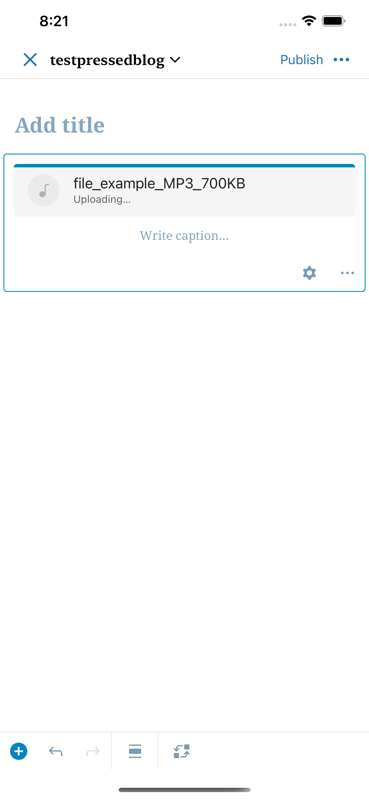
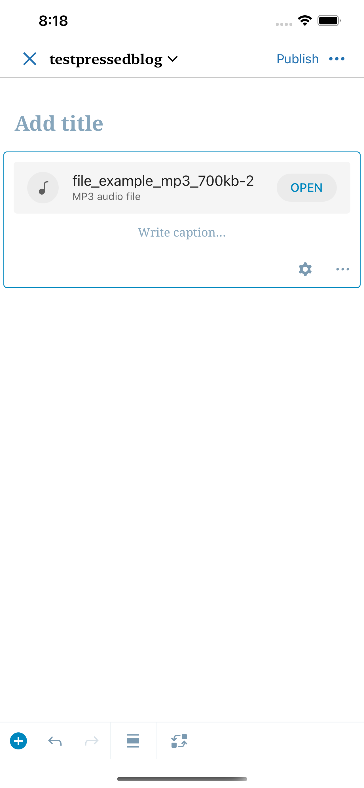
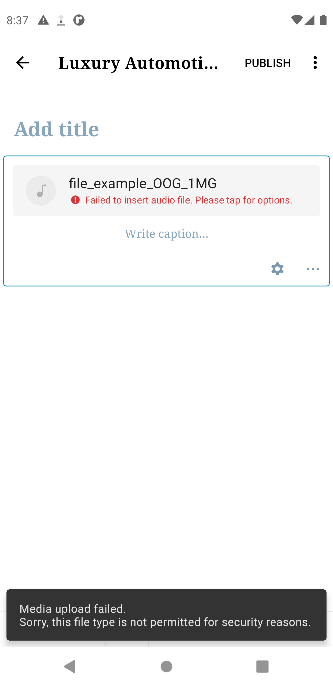
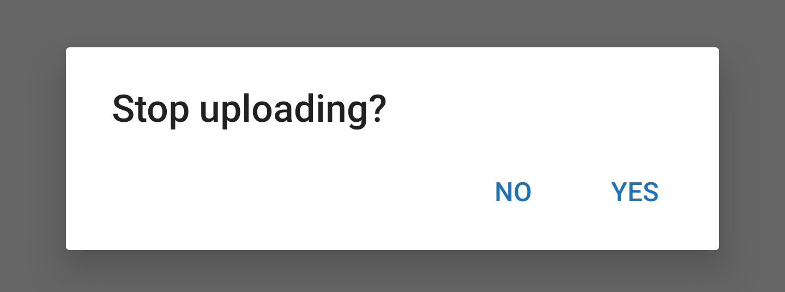
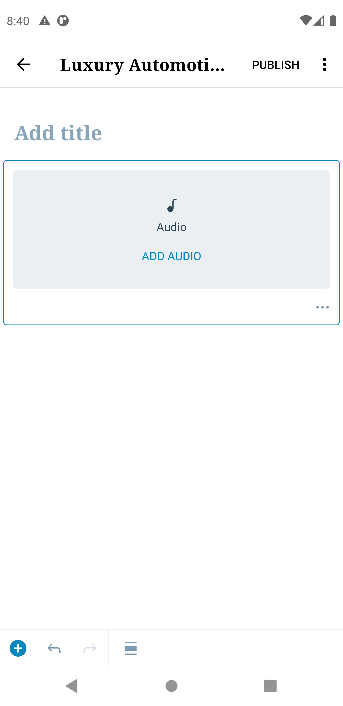

# Audio Block - Test Cases
##### TC001

**Upload completes successfully from the device library**

**Steps**
- Tap on Add Audio on the placeholder. 
- Tap option "Choose from device" and choose an audio file. 

**Expected Behavior**
- Expect to see the upload indicator, filename and the word "Uploading".
- Expect to not see an audio file type.

<kbd></kbd>

- Expect to see audio filename, audio MIME type and an Open button once the upload is complete.  

<kbd></kbd>

--------------------------------------------------------------------------------

##### TC002

**Insert completes successfully from the WordPress Media library**

**Steps**
- Tap on Add Audio on the placeholder. 
- Tap option "WordPress Media Library" and choose an audio file. 

**Expected Behavior**
- Expect to see filename, file type  and an Open button.  

<kbd></kbd>

--------------------------------------------------------------------------------

##### TC003

**Upload fails from the device library**

**Steps**
-   Tap on Add Audio on the placeholder or the Replace audio button in the toolbar.
-   Tap option ‘Choose from device’ and choose an audio file.
-   Turn off the internet connection and wait for a moment.

**Expected Behavior**
-   You should see an error that says "Failed to insert audio file. Please tap for options".

<kbd></kbd>

**Next Steps**

-   Turn your internet connection back on.
-   Tap on the Audio block itself.
-   You should be asked to retry.

**Expected Behavior**

<kbd></kbd>

**Next Step**
-   Tap retry

**Expected Behavior**
-   The upload should continue.

**Alternative Step (Android only)**
-   Tap Remove upload.

**Expected Behavior**
-   The placeholder should now be visible and the Audio Player UI should be cleared.
--------------------------------------------------------------------------------
##### TC004

**Stop the audio file upload before it completes**

**Steps**

-   Tap on Add Audio on the placeholder or edit button in the toolbar.
-   Tap option ‘Choose from device’ and choose a file.
-   While the upload is in progress tap on the Audio Block.

**Expected Behavior**

-   You should see the below message:

<kbd></kbd>

**Next Step**

-   Tap Yes

**Expected Behavior**

-   You should see that Audio block is cleared and the placeholder component is now visible.

<kbd></kbd>

--------------------------------------------------------------------------------
##### TC005

**Close the post with an ongoing audio file upload**

**Steps**

-   Add an Audio block and insert an audio file from your device.
-   While there’s an ongoing upload, save the post as a draft.

**Expected Behavior**

-   Verify that you see the upload progress in post summary of the Post item in the Posts list.
<kbd></kbd>

**Next Steps**

-   Wait until upload finishes.
-   Re-open the post.

**Expected Behavior**

-   Verify that Audio block shows the filename, file type and the OPEN button.
-   You can also switch to HTML mode to verify that the upload was complete. This is done by checking to see that the hyperlink of the Audio block points to a remote media url and not a local one. 

--------------------------------------------------------------------------------
##### TC006

**Replace the selected files**

**Steps**

-   Tap on an existing Audio Block that has an audio file. Note the file name for comparison in an upcoming step. 
-   From the toolbar, click on the replace audio button. 
-   The Replace audio bottom sheet will now be visible. 
-   Select a new file via the Choose from device or WordPress Media Library option. 

**Expected Behavior**

-   Verify that you see a new filename.

--------------------------------------------------------------------------------
##### TC007

**Change the alignment in the Audio Block**

**Step**
- Press on the Alignment toolbar button.

**Expected Behavior**

- Currently only the full width option is supported.

--------------------------------------------------------------------------------
##### TC008

**Autoplay setting**

**Steps**

- Press the Audio settings icon.
- Switch ON the option for the Autoplay setting.

**Expected Behavior**

- On HTML mode there should be the `autoplay` attribute in the `<audio>` tag.

--------------------------------------------------------------------------------
##### TC0009

**Loop setting**

**Steps**

- Press the Audio settings.
- Switch ON the option for the Loop setting.

**Expected Behavior**

- On HTML mode there should be the `loop` attribute in the `<audio>` tag.

--------------------------------------------------------------------------------
##### TC010

**Close/Re-open post with an ongoing audio file upload**

**Steps**

-   Add an Audio block and insert an audio file from your device.
-   While there’s an ongoing upload, close the editor by saving the post as draft.

**Expected Behavior**

-   Verify that you see the upload progress in post summary of the Post item in the Posts list.
<kbd></kbd>

**Next Steps**

-   Open the post while the upload is still in progress.

**Expected Behavior**

-   Verify that you see a upload progress. 

<kbd></kbd>
