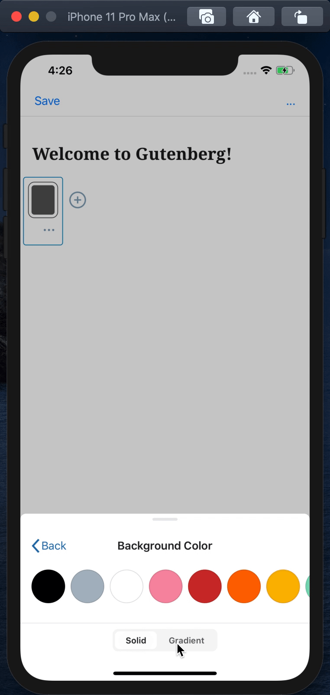
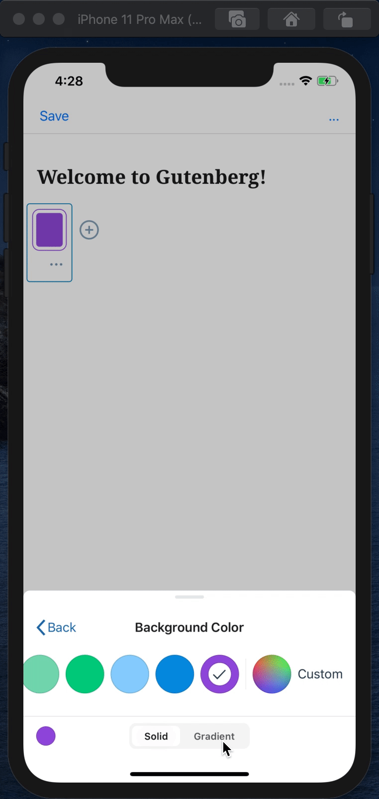
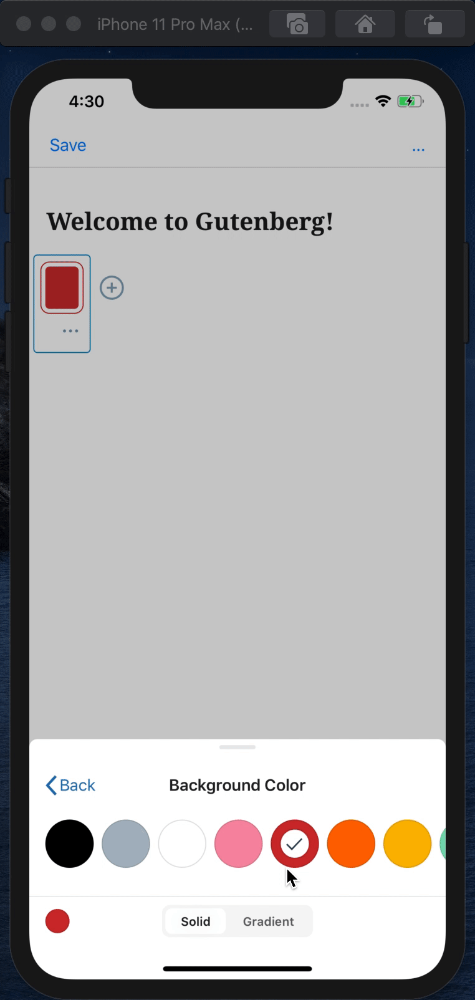
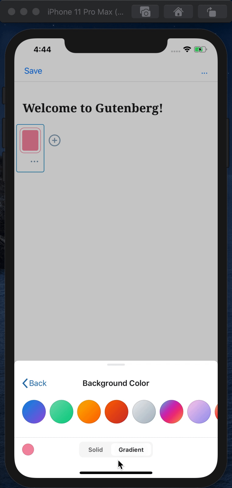
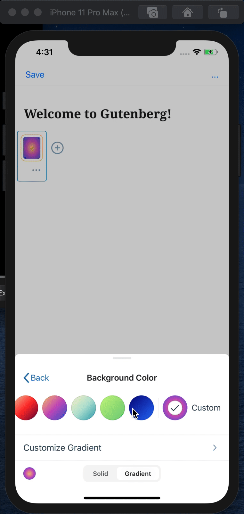

# Color Settings - Test Cases

#### **Precondition**

1. Added block with color support such as `Buttons` or `Cover`.
2. Opened color settings.

--------------------------------------------------------------------------------

##### TC001

### Colors segmented controls

**Steps:**

* Switch several times between `Solid` and `Gradient` segments 

**Expected behavior:**

* Selection animation works smoothly
* Color swatches fade parallel with active segment change

--------------------------------------------------------------------------------

##### TC002

### Scroll color palette to start

**Steps:**

* Select one of the last solid colors (_blue or purple_)
* Select `Gradient` segment

**Expected behavior:**

* Color list is scrolled to the start
* Color swatches fade parallel with scroll

--------------------------------------------------------------------------------

##### TC003

### Scroll color palette to the end

**Steps:**

* Press `Custom` color picker (at the end of the list)
* Select any color and press `Apply` button / `Check` icon button (_Android_)
* Press `Back` button
* Open color settings

**Expected behavior:**

* Color list is scrolled to the end (to the _custom_ color)

--------------------------------------------------------------------------------

##### TC004

### Pressing color swatch

**Steps:**

* Press any color several times

**Expected behavior:**

* Color swatch is bouncing on every press
* Selected icon on white background fades in over the color swatch (_only on the first press_)

--------------------------------------------------------------------------------

##### TC005

### Customize gradient color

**Steps:**

* Select `gradient` segment
* Press any color

**Expected behavior:**

* `Customize Gradient` slides in

**Next Steps:**

* Press `Customize Gradient`
* Play with `Angle` and observe the color in block

**Expected behavior:**

* Linear background color angle is changed

**Next Steps:**

* Change type to `Radial`

**Expected behavior:**

* `Angle` control slides out

**Next Steps:**

* Press `Back` button

**Expected behavior:**

* Selected `Custom` picker button appeared at the end of the gradient colors list

**Next Steps:**

* Press `Back` button
* Open color settings

**Expected behavior:**

* Colors list is always scrolled to the end (to the _custom_ color) when custom color is selected

**Next Steps:**

* Select one of the last gradient colors available on the screen

**Expected behavior:**

* List is scrolled and `Custom` button slides out

--------------------------------------------------------------------------------

##### TC006

### Custom color picker

**Steps:**

* Press `Custom` color picker (at the end of the list)

**Expected behavior:**

* Expect sheet slides up (_its height animates_)

**Next Steps:**

* Play with picker
* Observe if background color in block is changing
* Select any color and press `Apply` button / `Check` icon button (_Android_)

**Expected behavior:**

* Chosen color is set

**Next Steps:**

* Press `Custom` button

**Expected behavior:**

* Picker is located on chosen color

**Next Steps:**

* Play with picker and select different color
* Press `Cancel` button / `Cross` icon button (_Android_)

**Expected behavior:**

* Background color returned to the set color

**Next Steps:**

* Press `Custom` button
* Play with picker and select different color
* Press anywhere outside the sheet to close it

**Expected behavior:**

* Background color returned to the set color