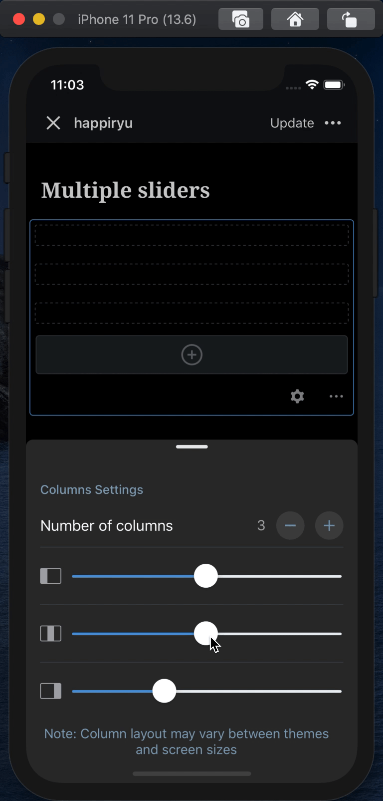

# Columns Block - Test Cases

--------------------------------------------------------------------------------

##### TC010

### Columns percentage mechanism - custom percentage values are rendered correctly on frontend

- Add a `Columns` block
- Expect to see bottom sheet with layout picker
- Dismiss the layout picker
- Select the first column, go to its settings
- Use the text input to set its width to a custom value, let's say: `90`
- Set the second column width to another custom value, let's say: `55.5`
- Switch to HTML mode
- Expect that first column has width: `90` and the second one: `55.5`
- Check the preview and expect to see that the front end reflects the column widths

--------------------------------------------------------------------------------

##### TC011

### Multiple slider in columns parent

- Add a `Columns` block
- Expect to see bottom sheet with layout picker
- Press `Cancel` button on layout picker
- Open `Columns` settings
- Play with sliders
- Expect that fill level in the preview (to the left of a slider) is changing proportionally in all columns

--------------------------------------------------------------------------------
