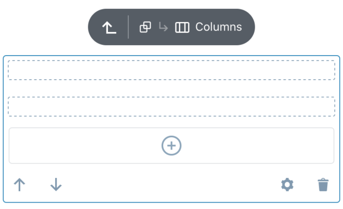
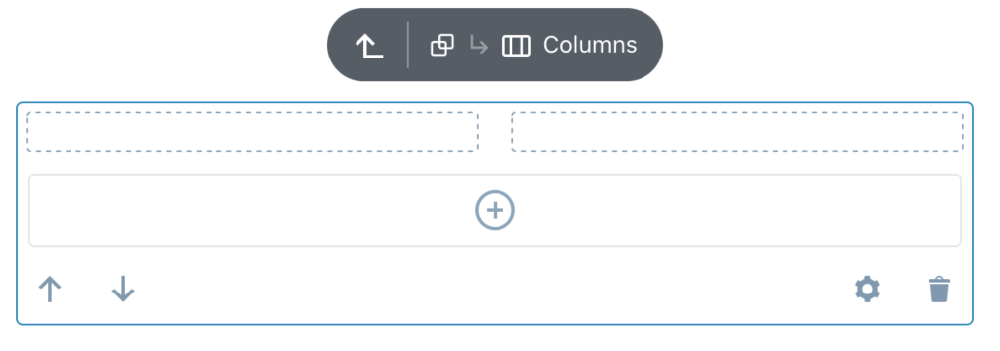
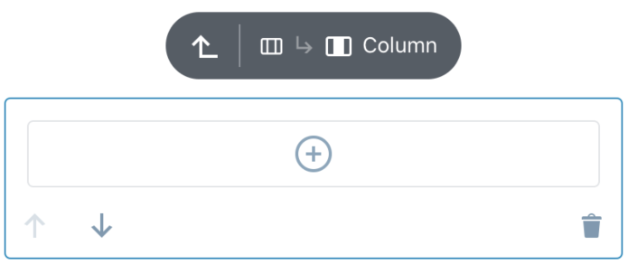
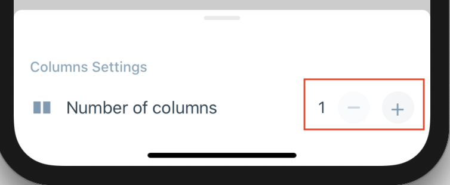
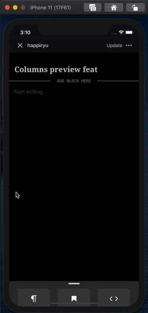

# Columns Block - Test Cases

--------------------------------------------------------------------------------

##### TC001

### Columns block is added with default number of Column

- Add a `Columns` block
- Press `Cancel` button on layout picker
- Expect `Columns` to have **two** `Column` block inside

Expected look:  

--------------------------------------------------------------------------------

##### TC002

### Check if Column placeholders is visible for the unselected state

- Add a `Columns` block
- Press `Cancel` button on layout picker
- Deselect
- Expect to see placeholder for each `Column` added in `Columns`

Expected look:

Portrait | Landscape
-|-
|

--------------------------------------------------------------------------------

##### TC003

### Adding Column with AppenderButton

- Add a `Columns` block
- Press `Cancel` button on layout picker
- Having `Columns` block selected press `AppenderButton`
- Expect new `Column` to be added

Expected look:  

--------------------------------------------------------------------------------

##### TC004

### Adding and removing Column with BottomSheet Stepper control

- Add a `Columns` block
- Press `Cancel` button on layout picker
- Open `Columns` settings with option button on toolbar
- Expect to increase `Column` number after press `+` button
- Expect to descrease `Column` number after press `-` button (exception: [see TC007](https://github.com/wordpress-mobile/test-cases/blob/master/test-cases/gutenberg/columns.md#tc007))

--------------------------------------------------------------------------------

##### TC005

### Max limit of Column number

- Add a `Columns` block
- Press `Cancel` button on layout picker
- Increase number of `Column`
- Expect have **no limit** with possible number of `Column` to add

--------------------------------------------------------------------------------

##### TC006

### Min limit of Column number

- Add a `Columns` block
- Press `Cancel` button on layout picker
- Increase number of `Column`
- Start removing `Column` using BottomSheet `Stepper`
- Expect to decrease `Column` number to minimum value of 1

Expected look:  

--------------------------------------------------------------------------------

##### TC007

### Removing Column with remove button

- Add a `Columns` block
- Press `Cancel` button on layout picker
- Increase number of `Column`
- Select one of the `Column` and press remove button
- Expect `Column` to be removed and selection is moved to previous one

Exception:

- If `Columns` has only one `Column` left [see TC009](https://github.com/wordpress-mobile/test-cases/blob/master/test-cases/gutenberg/columns.md#tc007)

--------------------------------------------------------------------------------

##### TC008

### Removing the only one left Column with remove button

- Add a `Columns` block
- Press `Cancel` button on layout picker
- Reduce `Column` number to one
- Having the last one `Column` selected press remove button
- Expect `Column` and whole `Columns` block to be removed

--------------------------------------------------------------------------------

##### TC009

### Changing alignment on Columns

- Add a `Columns` block
- Press `Cancel` button on layout picker
- Set `verticalAlignment` on `Columns` block
- Select one of the `Column`
- Expect selected `Column` have the same `verticalAlignment` value
- Expect the same `verticalAlignment` for other `Column` as well

--------------------------------------------------------------------------------

##### TC010

### Changing alignment on individual Columnn

- Add a `Columns` block
- Press `Cancel` button on layout picker
- Set `verticalAlignment` on `Columns` block
- Select one of the `Column`
- Set `verticalAlignment` on `Column` block
- Expect new `Column` have proper `verticalAlignment` value
- Go back with the selection to `Columns` block
- Expect `verticalAlignment` on `Columns` block doesn't change
- Select another `Column` block (different than before)
- Expect `verticalAlignment` on selected `Column` block doesn't change

--------------------------------------------------------------------------------

##### TC011

### Alignment attribute is properly passed when adding Column

- Add a `Columns` block
- Press `Cancel` button on layout picker
- Set `verticalAlignment` on `Columns` block
- Add new `Column`
- Expect new `Column` have the same `verticalAlignment` value

--------------------------------------------------------------------------------

##### TC012

### Deep nesting is possible (iOS only)

- Add a `Columns` block
- Press `Cancel` button on layout picker
- Nest blocks inside multiple `Columns` blocks (at least 3 levels deep)
- Expect app do not crash

--------------------------------------------------------------------------------

##### TC013

### Appearance in vertical device position (vertical layout)

- Add a `Columns` block
- Press `Cancel` button on layout picker
- Create some nested structure adding more `Column` and nesting `Columns`
- Expect all `Column` is stacked (only 1 `Column` in row is render)
- Expect space around blocks do not bounce when changing selection (exception is the trasition of the selected block connected with making space for FloatingToolbar)
- Expect no weird/unexpected extra free space around blocks
- Expect the space from screen edge to content should equals `16px`

Exception:

- If there is enought space (more than `480px`) for `Columns` then it will be render in `horizontal` layout

Expected look:  

- Space of `16px` left/right

--------------------------------------------------------------------------------

##### TC014

### Appearance in horizontal device position (horizontal layout)

- Rotate device to horizontal position
- Add `Columns` block
- Press `Cancel` button on layout picker
- Create some nested structure adding more `Column` and nesting `Columns`
- Expect all `Column` is distributed in row depending on available space for container:
  - below `480px` then expect 1 `Column` in row to be rendered
  - between `480px` and `768px` then expect  2 `Column` in row to be rendered
  - more than `768px` then expect as much `Column` as possible in row to be rendered
- Expect space around blocks do not bounce when changing selection (exception is the trasition of the selected block connected with making space for FloatingToolbar)
- Expect no weird/unexpected extra free space around blocks
- Expect the space around each `Column` should equals `16px`

Expected look:  

- Space of `16px` left/right/top/bottom

--------------------------------------------------------------------------------

##### TC015

### Mover direction

- Add `Columns` block
- Press `Cancel` button on layout picker
- Create some nested structure adding more `Column` and nesting `Columns`
- Make `Column` stacked in `Columns` by rotate device to vertical position
- Select `Column`
- Expect `Mover` controls be in vertical position
- Switch `Columns` to horizontal layout by rotate device to horizontal position
- Select `Column`
- Expect `Mover` controls be in horizontal position
- Expect nested `Column` has proper `Mover` position

Expected look:  

--------------------------------------------------------------------------------

##### TC016

### Check if Column placeholder is render in nested structure

- Add a `Columns` block
- Press `Cancel` button on layout picker
- Nest some `Columns` inside one of the `Column`
- Select top-most `Columns` block in hierarchy
- Check if you are able to see `Column` placeholder of nested blocks wrapped with dashed border when the parent is selected
- Select one of the `Column`
- Expect to see it's `AppenderButton` after selecting last `Column`  

Expected look:  

- Post title is not dimmed
- Navigation arrows is not visible
- Only selected block title is visible in breadcrumbs

--------------------------------------------------------------------------------

##### TC017

### Unselected Column placeholder is streched to content in nested structure

- Add a `Columns` block
- Press `Cancel` button on layout picker
- Switch to `horizontal` layout
- Add some blocks inside one of the `Column`
- Select top-most `Columns` block in hierarchy
- Expect empty `Column` placeholder to be stretched accordingly
- Select `Column` with the content
- Expect empty `Column` placeholder in the same row to be stretched accordingly

Expected look:  

- Post title is not dimmed
- Navigation arrows is not visible
- Only selected block title is visible in breadcrumbs
- Placeholder (dashed line is stretched to content)

--------------------------------------------------------------------------------

##### TC018

### Check if in DarkMode all components gets proper colors

- Add a `Columns` block
- Create nested structure
- Switch to DarkMode
- Check if all components switch it's color schema to dark

Expected look:  

--------------------------------------------------------------------------------

##### TC019

### Columns layout picker flow

- Add a `Columns` block
- Expect to see bottom sheet with layout picker
- Choose one of the options e.g: `33/33/33`
- Select the first column
- Open its settings
- Change the value e.g. to  `90`
- Expect that fill level in the preview (to the left of a slider) increased
- Close bottom sheet and select the second column
- Open its settings
- Press text input (to the right of a slider)
- Type value with more than 1 decimal e.g.: `55.55555` and press `Done`
- Expect to have value with only 1 decimal
- Close bottom sheet and switch to HTML mode
- Expect that first column has width equal `90` and the second `55.5`
- Save the post and open it on web
- Expect to see columns displayed proportionally to the set width

--------------------------------------------------------------------------------

##### TC020

### Multiple slider in columns parent

- Add a `Columns` block
- Expect to see bottom sheet with layout picker
- Press `Cancel` button  on layout picker
- Open `Columns` settings
- Play with sliders
- Expect that fill level in the preview (to the left of a slider) is changing proportionally in all columns

--------------------------------------------------------------------------------