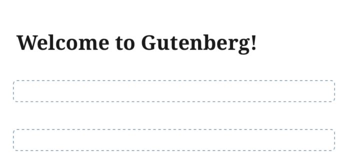
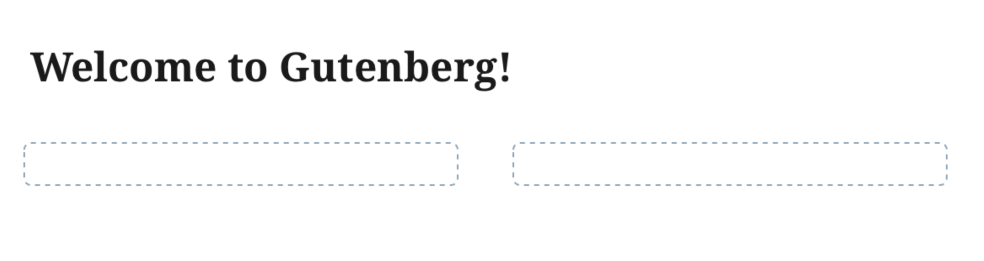
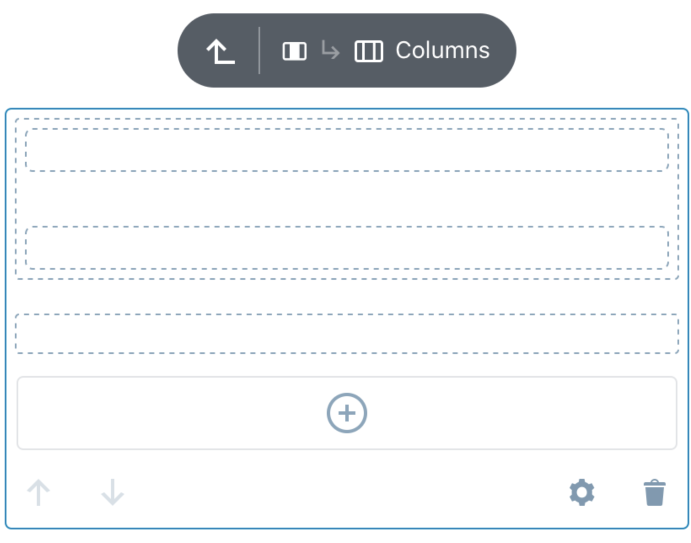
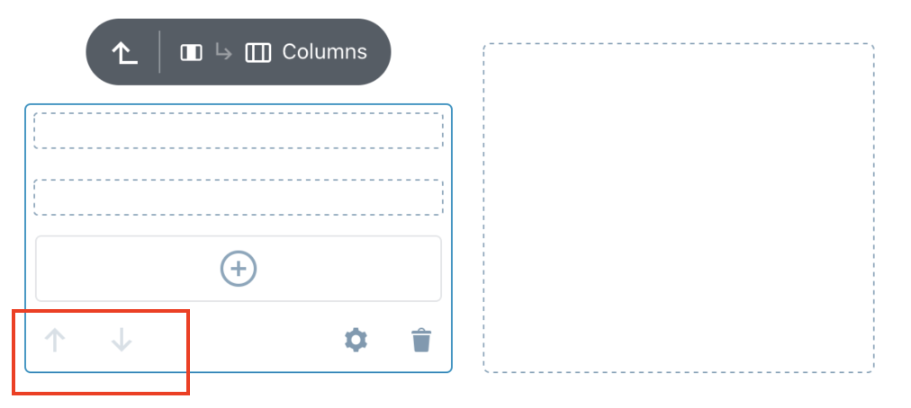
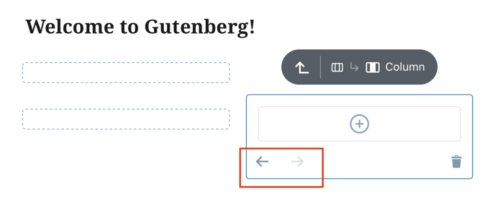
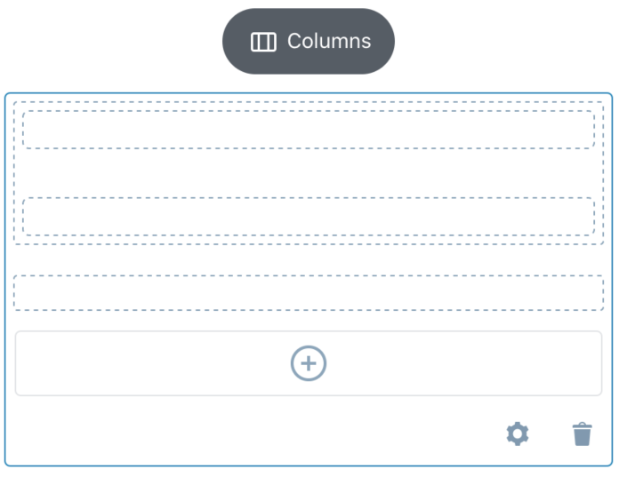
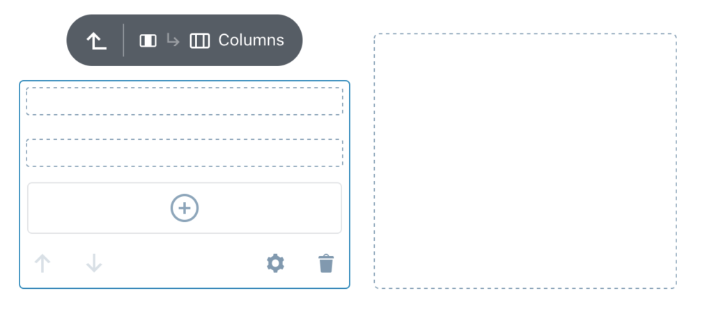
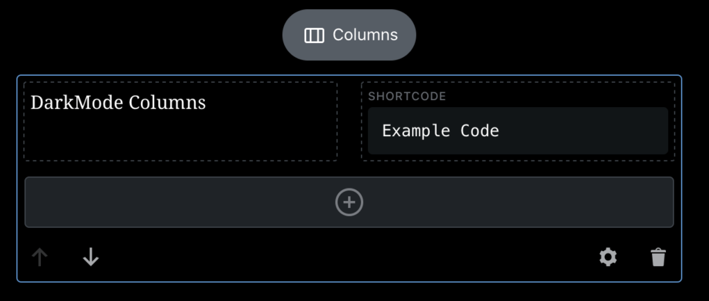
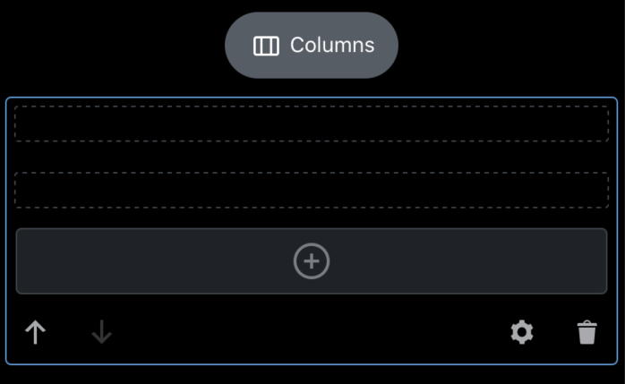

# Columns Block - Test Cases

--------------------------------------------------------------------------------

##### TC001

### Check if Column placeholders is visible for the unselected state

- Add a `Columns` block
- Deselect
- Expect to see placeholder for each `Column` added in `Columns`

Expected look:

Portrait | Landscape
-|-
|

--------------------------------------------------------------------------------

##### TC002

### Max limit of Column number

- Add a `Columns` block
- Increase number of `Column`
- Expect have **no limit** with possible number of `Column` to add

--------------------------------------------------------------------------------

##### TC003

### Deep nesting is possible

- Add a `Columns` block
- Nest blocks inside multiple `Columns` blocks (at least 3 levels deep)
- Expect app do not crash

--------------------------------------------------------------------------------

##### TC004

### Appearance in vertical device position (vertical layout)

- Add a `Columns` block
- Create some nested structure adding more `Column` and nesting `Columns`
- Expect all `Column` is stacked (only 1 `Column` in row is render)
- Expect space around blocks do not bounce when changing selection (exception is the transition of the selected block connected with making space for FloatingToolbar)
- Expect no weird/unexpected extra free space around blocks
- Expect the space from screen edge to content should equals `16px`

Exception:

- If there is enough space (more than `480px`) for `Columns` then it will be render in `horizontal` layout

Expected look:  

- Space of `16px` left/right

--------------------------------------------------------------------------------

##### TC005

### Appearance in horizontal device position (horizontal layout)

- Rotate device to horizontal position
- Add `Columns` block
- Create some nested structure adding more `Column` and nesting `Columns`
- Expect all `Column` is distributed in row depending on available space for container:
  - below `480px` then expect 1 `Column` in row to be rendered
  - between `480px` and `768px` then expect 3 `Column` in row to be rendered
  - more than `768px` then expect as much `Column` as possible in row to be rendered
- Expect space around blocks do not bounce when changing selection (exception is the transition of the selected block connected with making space for FloatingToolbar)
- Expect no weird/unexpected extra free space around blocks
- Expect the space around each `Column` should equals `16px`

Expected look:  

- Space of `16px` left/right/top/bottom

--------------------------------------------------------------------------------

##### TC006

### Mover direction

- Add `Columns` block
- Create some nested structure adding more `Column` and nesting `Columns`
- Make `Column` stacked in `Columns` by rotate device to vertical position
- Select `Column`
- Expect `Mover` controls be in vertical position
- Switch `Columns` to horizontal layout by rotate device to horizontal position
- Select `Column`
- Expect `Mover` controls be in horizontal position
- Expect nested `Column` has proper `Mover` position

Expected look:  

--------------------------------------------------------------------------------

##### TC007

### Check if Column placeholder is render in nested structure

- Add a `Columns` block
- Nest some `Columns` inside one of the `Column`
- Select top-most `Columns` block in hierarchy
- Check if you are able to see `Column` placeholder of nested blocks wrapped with dashed border when the parent is selected
- Select one of the `Column`
- Expect to see it's `AppenderButton` after selecting last `Column`  

Expected look:  

- Post title is not dimmed
- Navigation arrows is not visible
- Only selected block title is visible in breadcrumbs

--------------------------------------------------------------------------------

##### TC008

### Unselected Column placeholder is streched to content in nested structure

- Add a `Columns` block
- Switch to `horizontal` layout
- Add some blocks inside one of the `Column`
- Select top-most `Columns` block in hierarchy
- Expect empty `Column` placeholder to be stretched accordingly
- Select `Column` with the content
- Expect empty `Column` placeholder in the same row to be stretched accordingly. Note: [known issue](https://github.com/wordpress-mobile/gutenberg-mobile/issues/4081) that the placeholder is not actually stretched vertically as expected.

Expected look:  

- Post title is not dimmed
- Navigation arrows is not visible
- Only selected block title is visible in breadcrumbs
- Placeholder (dashed line is stretched to content)

--------------------------------------------------------------------------------

##### TC009

### Check if in DarkMode all components gets proper colors

- Add a `Columns` block
- Create nested structure
- Switch to DarkMode
- Check if all components switch it's color schema to dark

Expected look:  

--------------------------------------------------------------------------------

##### TC010

### Columns percentage mechanism - custom percentage values are rendered correctly on frontend

- Add a `Columns` block
- Expect to see bottom sheet with layout picker
- Dismiss the layout picker
- Select the first column, go to its settings
- Use the text input to set its width to a custom value, let's say: `90`
- Set the second column width to another custom value, let's say: `55.5`
- Switch to HTML mode
- Expect that first column has width: `90` and the second one: `55.5`
- Check the preview and expect to see that the front end reflects the column widths

--------------------------------------------------------------------------------

##### TC011

### Multiple slider in columns parent

- Add a `Columns` block
- Expect to see bottom sheet with layout picker
- Press `Cancel` button on layout picker
- Open `Columns` settings
- Play with sliders
- Expect that fill level in the preview (to the left of a slider) is changing proportionally in all columns

--------------------------------------------------------------------------------
