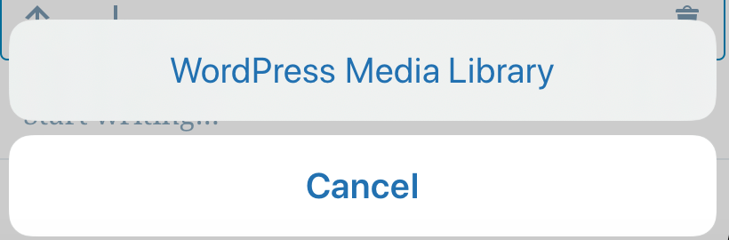
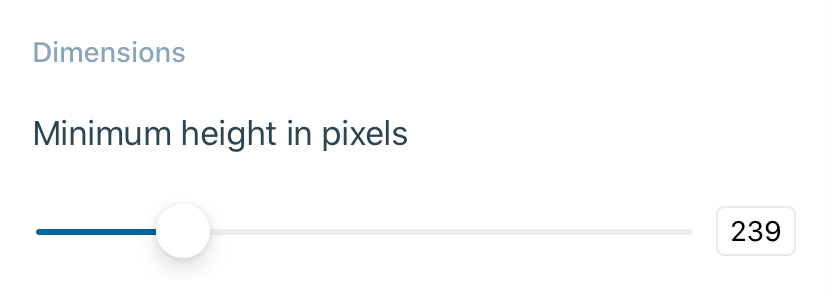
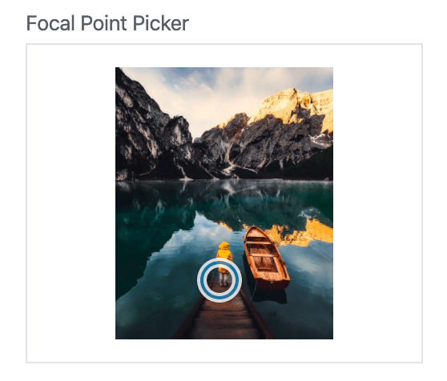
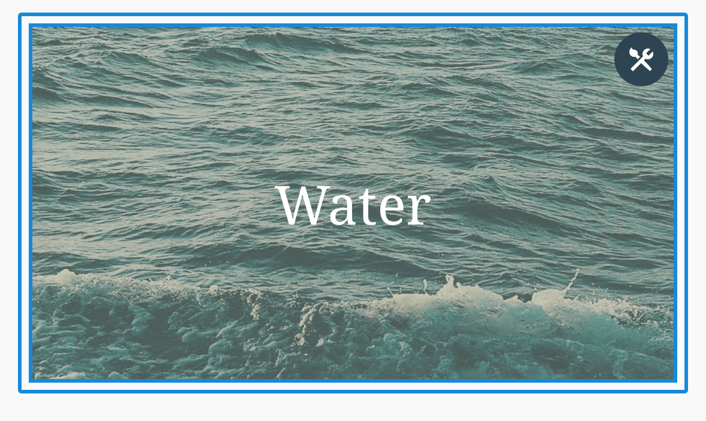
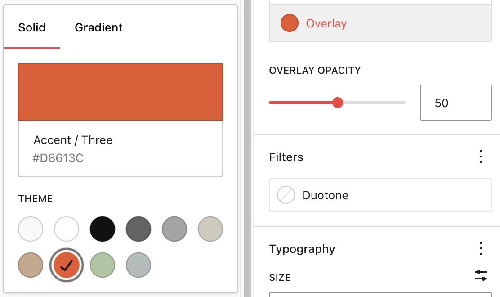
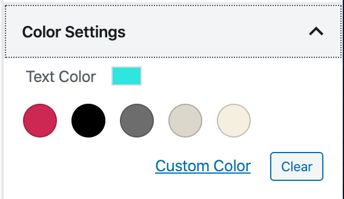
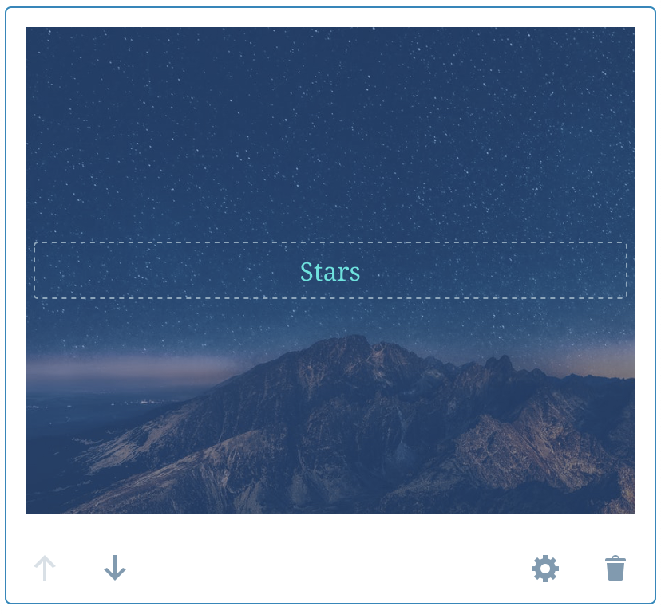
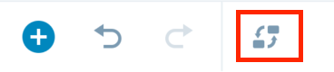
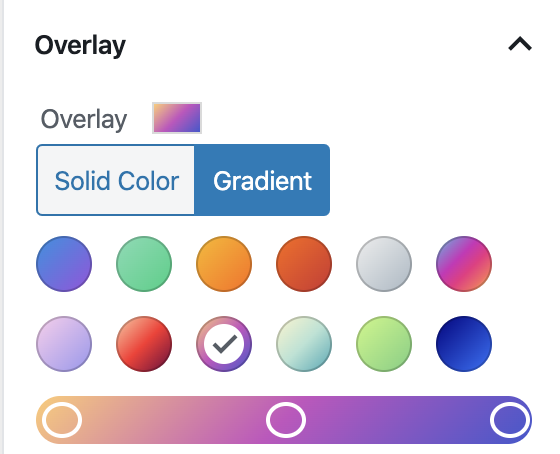
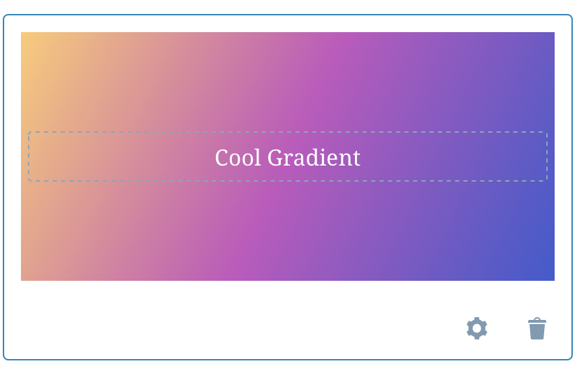

# Cover Block - Test Cases

##### TC001

### Add image

-   Add a cover block 
-   Tap on Add Image or Video
-   The picker should show up with the `WordPress Media library` option

-   Select and image
-   Expect to see the selected image in the Cover Block

--------------------------------------------------------------------------------

##### TC002

### Change settings

-   Add a cover block and select an image from the `WordPress Media library`
-   Tap on the settings icon of the block
-   Verify that the bottom sheet opens with the following settings

-   Update the values using the sliders
-   Verify that the Cover block changes accordingly

--------------------------------------------------------------------------------

##### TC003

### Focal point of an image

-   Add a Cover block from the Web editor
-   Select an image
-   Decrease the height of the block and use the Focal point picker in the right sidebar, select any point

-   Save the post
-   Open the post from the app
-   Expect to see the the Cover block with the image and the right focal point

--------------------------------------------------------------------------------

##### TC004

### Color styles

-   Add a Cover block from the Web editor
-   Select an image
-   Type in any text
-   Select the block
-   Add a **custom** solid overlay color

-   Select the text
-   Add a **custom** text color

-   Save the post
-   Open the post from the app
-   Expect to see the the Cover block with the image and color styles

--------------------------------------------------------------------------------

##### TC005

### Video background

#### **Precondition**

A site with premium or business plan

-   Add a Cover block
-   Tap on Add Image or Video
-   Select a video
-   Expect to see the video added and playing without sound

--------------------------------------------------------------------------------

##### TC006

### Replace media

-   Add a Cover block
-   Tap on Add Image or Video
-   Select an image
-   Expect to see the image added
-   Tap on the replace media option

-   Select another image
-   Expect to see the new image

--------------------------------------------------------------------------------

##### TC007

### Gradient overlay

-   Add a Cover block from the Web editor
-   Select a gradient background

-   Open the post from the app
-   Expect to see the Cover block with the gradient as background

