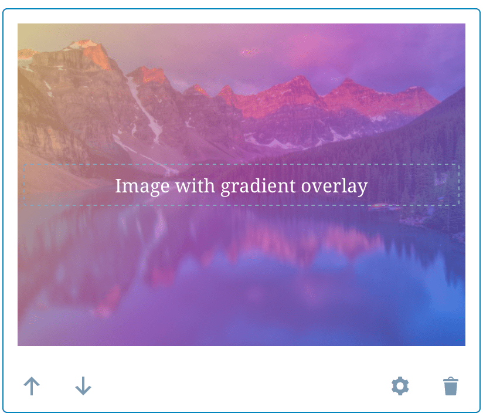
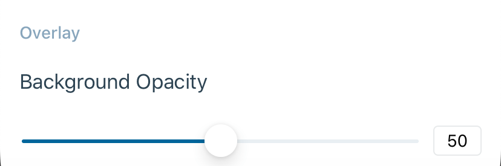

# Cover Block - Test Cases

##### TC001

### Add image background from WordPress Media library

-   Add a cover block 
-   Tap on Placeholder
-   The picker should show up with the `WordPress Media library` option

-   Select and image
-   Expect to see the selected image in the Cover Block

--------------------------------------------------------------------------------

##### TC002

### Change Minimum height in pixels

-   Add a cover block and select an image from the `WordPress Media library`
-   Tap on the settings icon of the block
-   Verify that the bottom sheet opens with the Minimum height in pixels setting

-   Update the value using the slider
-   Close the bottom sheet
-   Expect to see the cover with the new height value

--------------------------------------------------------------------------------

##### TC003

### Image focal point is rendered properly

-   Add a Cover block from the Web editor
-   Select an image
-   Decrease the height of the block and use the Focal point picker in the right sidebar, select any point

-   Save the post
-   Open the post from the app
-   Expect to see the the Cover block with the image and the right focal point

--------------------------------------------------------------------------------

##### TC004

### Custom color is rendered properly

-   Add a Cover block from the Web editor
-   Select an image
-   Type in any text
-   Select the block
-   Add a **custom** solid overlay color

-   Select the text
-   Add a **custom** text color

-   Save the post
-   Open the post from the app
-   Expect to see the the Cover block with the image and color styles

--------------------------------------------------------------------------------

##### TC005

### Add Video Background from WordPress Media library

#### **Precondition**

A site with premium or business plan

-   Add a Cover block
-   Tap on Placeholder
-   Select a video
-   Expect to see the video added and playing without sound

--------------------------------------------------------------------------------

##### TC006

### Replace media

-   Add a Cover block
-   Tap on Placeholder
-   Select an image
-   Expect to see the image added
-   Tap on the image editing icon on the top right
-   Select replace option
-   Select another image
-   Expect to see the new image

--------------------------------------------------------------------------------

##### TC007

### Gradient background is rendered properly

-   Add a Cover block from the Web editor
-   Select a gradient background

-   Open the post from the app
-   Expect to see the Cover block with the gradient as background

--------------------------------------------------------------------------------

##### TC008

### Gradient overlay is rendered properly

-   Add a Cover block from the Web editor
-   Select an image as a background
-   Select a gradient overlay

-   Open the post from the app
-   Expect to see the Cover block with the image and the gradient on top as an overlay

--------------------------------------------------------------------------------

##### TC009

### Change Background Opacity

-   Add a cover block and select an image from the `WordPress Media library`
-   Tap on the settings icon of the block
-   Verify that the bottom sheet opens with the Background Opacity setting

-   Update the value using the slider
-   Close the bottom sheet
-   Expect to see the cover with the new overlay opacity value

--------------------------------------------------------------------------------

##### TC010

### Close/Re-open post with an ongoing image upload

Cover block should continue normally if the editor is closed and re-opened with ongoing uploads.

**Steps:**

* Add a cover block and tap on placeholder
* Select "Choose from device" option
* Select an image from the device and confirm the selection
* While image is uploading, leave the editor
* Verify that you see the upload progress in post summary:
  * 
* Re-open the post with the cover block before uploads complete

**Expected behavior:**

* Cover should show the image being uploaded
* A progress bar should be displayed indicating the upload progress
* After the image upload has completed, the image url scheme should be `https://` (not `file:///`) in HTML mode

##### Known issue:

If the user leaves the editor and returns while the image is uploading, _and_ the upload finishes before the React Native editor has fully loaded, the upload completion event is missed, resulting in a UI state indicating a failed upload, even when the upload has completed.

--------------------------------------------------------------------------------

##### TC011

### Close post with an ongoing image upload

Cover block should allow uploading an image after the editor is closed.

**Steps:**

* Add a Cover block and tap placeholder
* Select "Choose from device" option
* Select an image from the device and confirm the selection
* While image is uploading, leave the editor
* Verify that you see the upload progress in post summary:
  * 
* Wait for the upload to complete while in the post list
* Re-open the post with the Cover block

**Expected behavior:**

* Cover should show all completed uploads
* The image url scheme should be `https://` (not `file:///`) in HTML mode

--------------------------------------------------------------------------------
