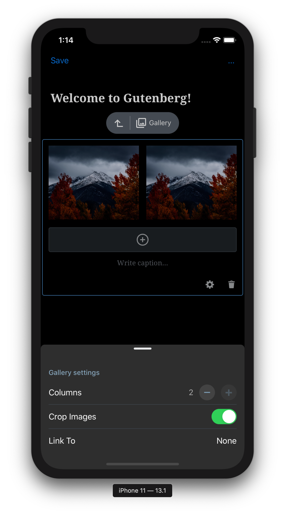
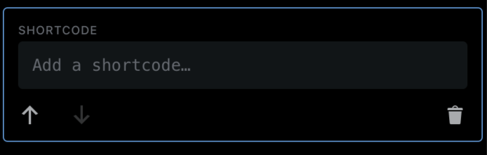
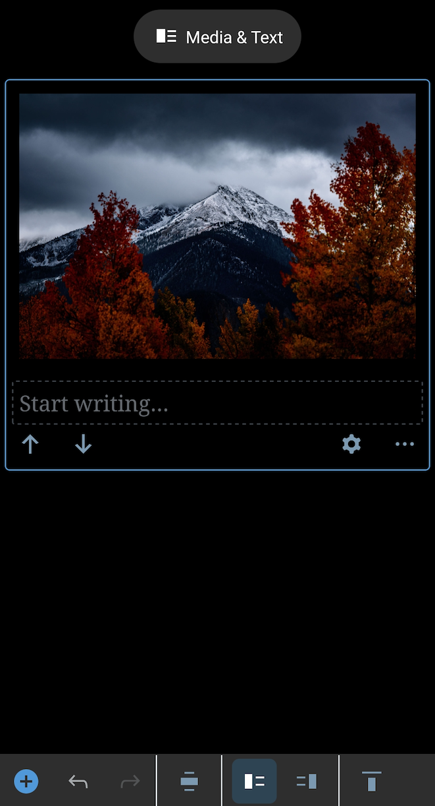
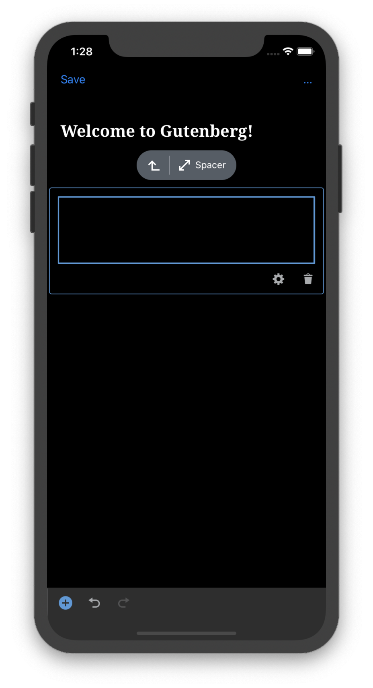
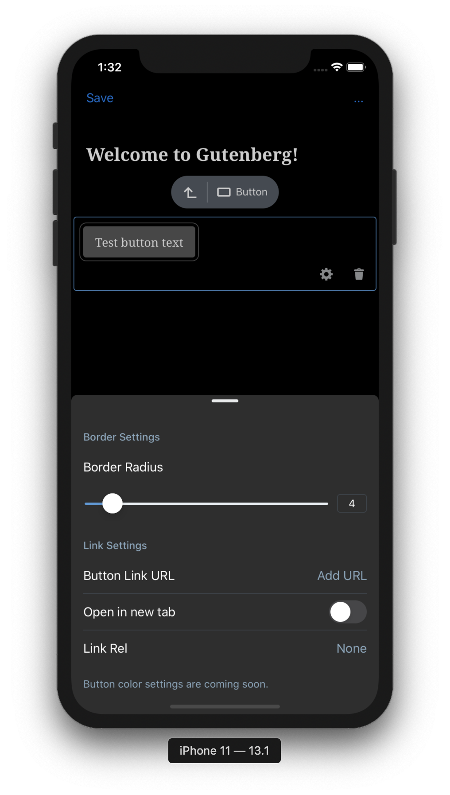

# Dark Mode - Test Cases

--------------------------------------------------------------------------------

##### TC001

### Gallery Block - Check if in DarkMode all components gets proper colors (iOS)

-   Add a `Gallery` block
-   Check if `Gallery` block in Dark Mode looks like below

Expected look:  

--------------------------------------------------------------------------------

##### TC002

### Shortcode Block - Check if in DarkMode all components gets proper colors (iOS)

-   Add a `Shortcode` block
-   Check if `Shortcode` block in Dark Mode looks like below

Expected look:  

--------------------------------------------------------------------------------

##### TC003

### MediaText Block - Check if in DarkMode all components gets proper colors (iOS)

-   Add a `MediaText` block
-   Check if `MediaText` block in Dark Mode looks like below

Expected look:  

--------------------------------------------------------------------------------

##### TC004

### Spacer Block - Check if in DarkMode all components gets proper colors (iOS)

-   Add a `Spacer` block
-   Check if `Spacer` block in Dark Mode looks like below

Expected look:  

--------------------------------------------------------------------------------

##### TC005

### Button Block - Check if in DarkMode all components gets proper colors (iOS)

-   Add a `Button` block
-   Check if `Button` block in Dark Mode looks like below

Expected look:  

--------------------------------------------------------------------------------

##### TC006

### Group Block - Check if in DarkMode all components gets proper colors (iOS)

-   Add a `Group` block
-   Check if `Group` block in Dark Mode looks like below

Expected look:  

--------------------------------------------------------------------------------