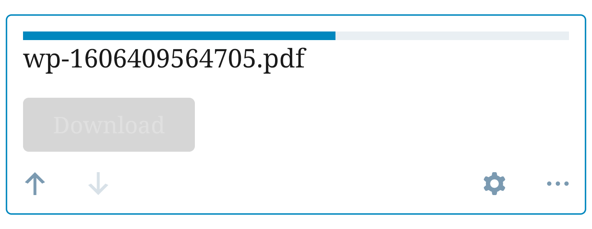
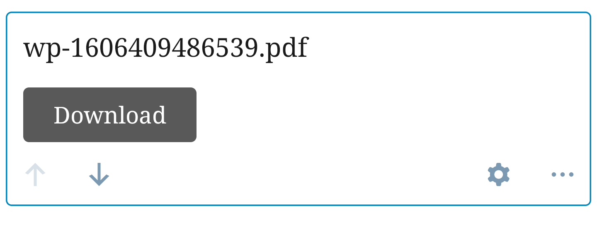
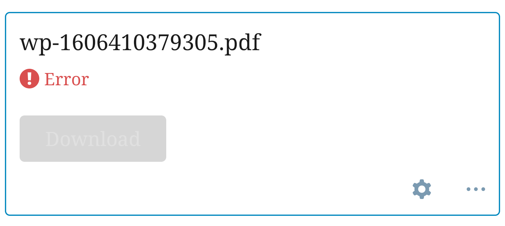
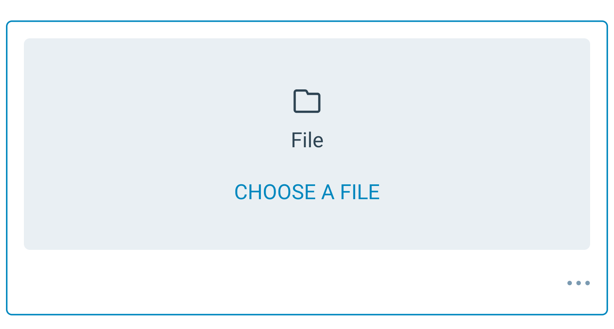
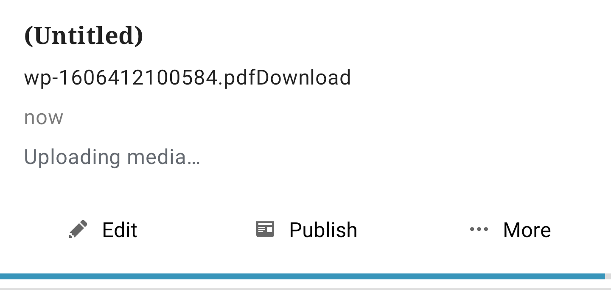
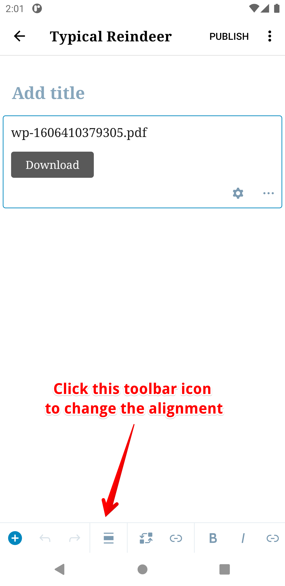
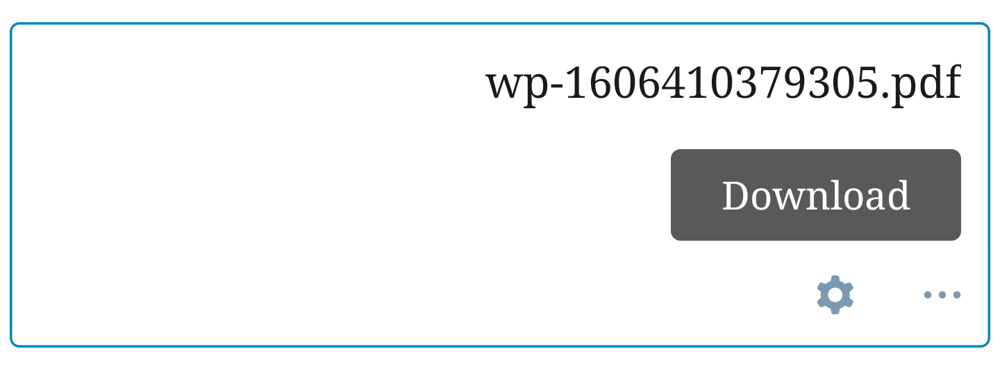

# File Block - Test Cases
##### TC001

**Upload completes successfully from the device library**

**Steps**
- Tap on Choose a file on the placeholder. 
- Tap option "Choose from device" and choose a file. 

**Expected Behavior**
- Expect to see the upload indicator and the Download button should be dimmed.
- Expect to not see a link or replace buttons in the toolbar.

- Expect to see file's name and an active Download button once the upload is complete.  
- Expect the link and replace buttons to appear in the toolbar

--------------------------------------------------------------------------------

##### TC002

**Insert completes successfully from the WordPress Media library**

**Steps**
- Tap on Choose a file on the placeholder. 
- Tap option "WordPress Media Library" and choose a file. 

**Expected Behavior**
- Expect to see file's name  and an active Download button.  

--------------------------------------------------------------------------------

##### TC003

**Upload fails from the device library**

**Steps**
-   Tap on Choose a file on the placeholder or the edit button in the toolbar.
-   Tap option ‘Choose from device’ and choose a file.
-   Turn off the internet connection and wait for a moment.

**Expected Behavior**
-   You should see an error message and a dimmed Download button.

**Next Steps**

-   Turn your internet connection back on.
-   Tap on the File block itself.
-   You should be asked to retry.

**Expected Behavior**

**Next Step**
-   Tap retry

**Expected Behavior**
-   The upload should continue.

**Alternative Step**
-   Tap Remove upload.

**Expected Behavior**
-   The placeholder should now be visible and the Download button and link should be cleared.
--------------------------------------------------------------------------------
##### TC004

**Stop the file upload before it completes**

**Steps**

-   Tap on Choose a file on the placeholder or edit button in the toolbar.
-   Tap option ‘Choose from device’ and choose a file.
-   While the upload is in progress tap on the File Block.

**Expected Behavior**

-   You should see the below message:

**Next Step**

-   Tap Yes

**Expected Behavior**

-   You should see that File block is cleared and the placeholder component is now visible.

--------------------------------------------------------------------------------
##### TC005

**Close the post with an ongoing file upload**

**Steps**

-   Add a File block and insert a file from your device.
-   While there’s an ongoing upload, save the post as a draft.

**Expected Behavior**

-   Verify that you see the upload progress in post summary of the Post item in the Posts list.

**Next Steps**

-   Wait until upload finishes.
-   Re-open the post.

**Expected Behavior**

-   Verify that File block shows the file name.
-   You can also switch to HTML mode to verify that the upload was complete. This is done by checking to see that the hyperlinks of the File block points to a remote media url and not a local one. 

--------------------------------------------------------------------------------
##### TC006

**Replace the selected files**

**Steps**

-   Tap on an existing File Block that has a file. Note the file name for comparison in an upcoming step. 
-   From the toolbar, click on the replace button. 
-   The Choose file bottom sheet will now be visible. 
-   Select a new file via the Choose from device or WordPress Media Library option. 

**Expected Behavior**

-   Verify that you see a new filename.

--------------------------------------------------------------------------------
##### TC007

**Change the alignment in the File Block**

**Step**
- Press on the Alignment toolbar button.

<kbd></kbd>

- Choose one of the options. For example, Align Right.

**Expected Behavior**

- Check to ensure the UI represents the alignment accordingly.
Note: Align left, Wide width and no option selected won't have visual differences.

--------------------------------------------------------------------------------
##### TC008

The test cases below apply to both the Block Settings icon and the Link toolbar icon. The only differentiator is the Block Settings contain a "Show download button" option while the Link settings via the toolbar does not. 

**The Link To Block Setting should open**

**Steps**

- Press the Block settings or Link Settings icon.
- Press the Link to icon. 

**Expected Behavior**

- Two different options should appear: Media file and Attachment Page
- Media File: The link should be set to the file itself.
- Attachment page: The link should be set to the item page.

--------------------------------------------------------------------------------
##### TC009

**Open link in new tab**

**Steps**

- Press the Block settings or Link Settings icon.
- Switch ON the option - Open link in new tab

**Expected Behavior**

- On HTML mode there should be the attributes `target="_blank" rel="noreferrer noopener"` in the `<a>` tag.

--------------------------------------------------------------------------------
##### TC0010

**Show/hide download button (Block Settings only)**

**Steps**

- Press the Block settings or Link Settings icon.
- Switch off the "Show download button" option.

**Expected Behavior**

- The Download button should disappear

--------------------------------------------------------------------------------
##### TC0011

**Copy file URL**

**Steps**

- Press the Block settings or Link Settings icon.
- Press on the Copy file URL option.
- The button title should change to Copied!

**Expected Behavior**

- The content should be in the device's clipboard.
- Paste the link from the pasteboard in any other field and it should appear.
