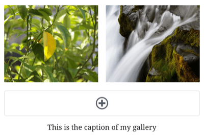
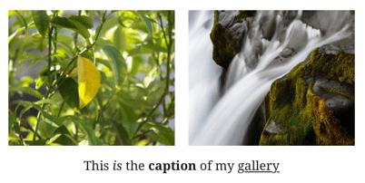
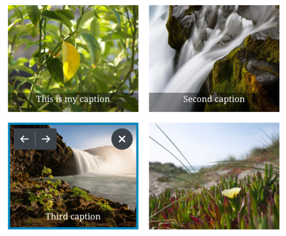
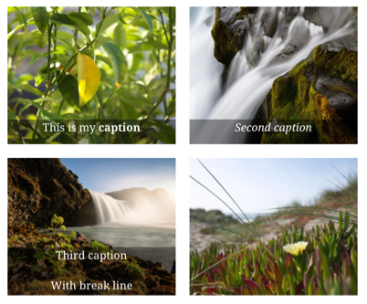
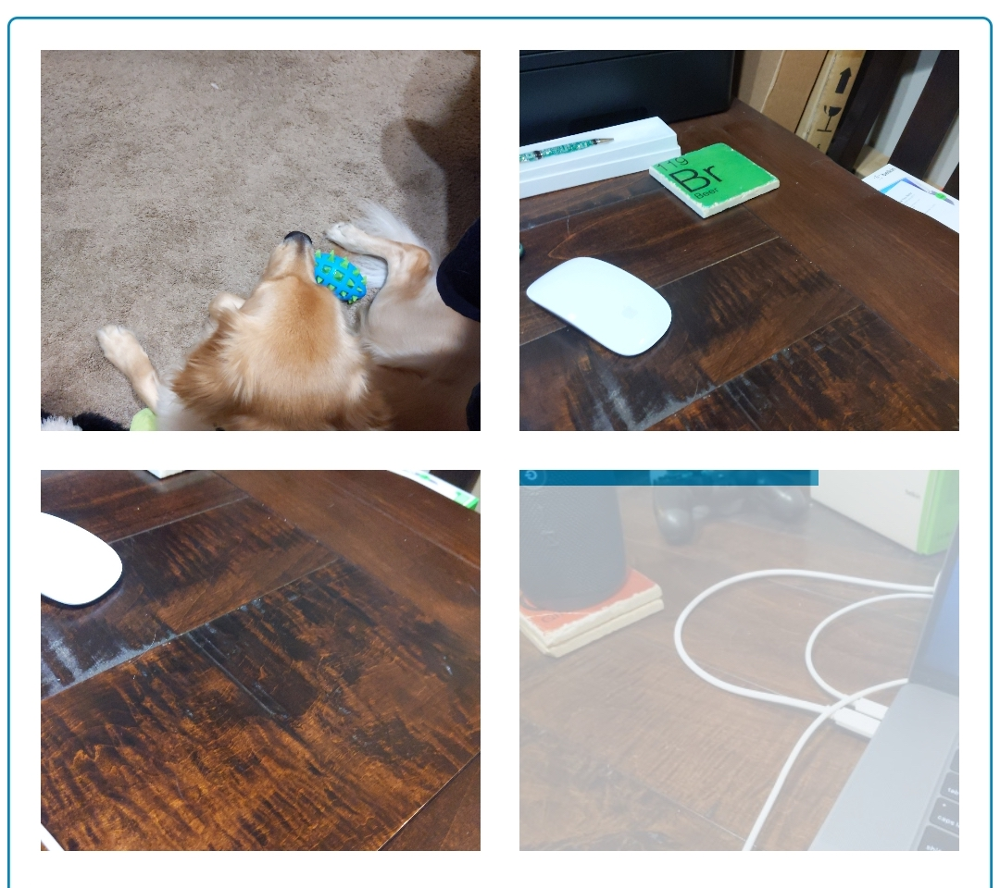

# Gallery Block - Test Cases

#### **Precondition**

A site with premium or business plan

--------------------------------------------------------------------------------

##### TC001

### Close/Re-open post with an ongoing image upload

Gallery block should continue normally if the editor is closed and re-opened with ongoing uploads.

**Steps:**

* Add a gallery block and tap "Add Media"
* Select "Choose from device" option
* Select multiple images from the device and confirm the selection
* While image are uploading, leave the editor
* Verify that you see the upload progress in post summary:
  * 
* Re-open the post with the gallery block before uploads complete

**Expected behavior:**

* Gallery should show all images being uploaded as dimmed
* Progress bars should be displayed indicating the upload progress
* After each image upload has completed:
  * Image should not be dim
  * Image url scheme should be `https://` (not `file:///`) in HTML mode

##### Known issue:

If the user leaves the editor and returns while the image is uploading, _and_ the upload finishes before the React Native editor has fully loaded, the upload completion event is missed, resulting in a UI state indicating a failed upload, even when the upload has completed.

--------------------------------------------------------------------------------

##### TC002

### Close post with an ongoing image upload

Gallery block should allow uploading multiple images after the editor is closed.

**Steps:**

* Add a gallery block and tap "Add Media"
* Select "Choose from device" option
* Select multiple images from the device and confirm the selection
* While image are uploading, leave the editor
* Verify that you see the upload progress in post summary:
  * 
* Wait for uploads to complete while in the post list
* Re-open the post with the gallery block

**Expected behavior:**

* Gallery should show all completed uploads
* The images' url schemes should be `https://` (not `file:///`) in HTML mode

--------------------------------------------------------------------------------

##### TC003

### Add caption to gallery

-   Add a Gallery block
-   Set a caption to your gallery

-   Add some styles to your caption:
    - Bold
    - Italic
    - Strikethrough
    - Expect all to work correctly
    
(Note: Underline text is only rendered if it is set by a .com site, the Underline format button is not available in mobile.)

-   Save the post
-   Open it and expect to see the captions with their styles

--------------------------------------------------------------------------------

##### TC004

### Add caption to gallery images

-   Add a Gallery block
-   Add some images to your gallery
-   Set some captions to your images by tapping on each image

-   Add some styles to your captions:
    - Bold
    - Italic
    - Break line
    - Expect all to work correctly

-   Save the post
-   Open it and expect to see the captions with their styles

--------------------------------------------------------------------------------

##### TC005

### Choose from device (stay in editor) - Successful upload

Gallery block should allow uploading multiple images from the device.

**Steps:**

* Add a gallery block and tap "Add Media"
* Select "Choose from device" option
* Select multiple images from the device and confirm the selection

**Expected behavior:**

* Gallery should show all images being uploaded as dimmed
* Progress bars should be displayed indicating the upload progress
* After each image upload has completed:
  * Image should not be dim
  * Image url scheme should be `https://` (not `file:///`) in HTML mode

--------------------------------------------------------------------------------

##### TC006

### Choose from device (stay in editor) - Failed upload

Gallery block should allow retrying failed uploads

**Steps:**

* Add a gallery block and tap "Add Media"
* Select "Choose from device" option
* Select multiple images from the device and confirm the selection
* While images are uploading, turn on airplane mode

**Expected behavior:**

* Images should indicate failed upload state
* Tapping a failed image should provide an option to retry the upload(s)

--------------------------------------------------------------------------------

##### TC007

### Take a photo

Gallery block should allow uploading images from the camera.

**Steps:**

* Add a gallery block and tap "Add Media"
* Select "Take a photo" option
* Take a photo and confirm the selection

**Expected behavior:**

* Gallery should show the image being uploaded as dimmed
* A progress bar should be displayed indicating the upload progress
* After the image upload has completed:
  * Image should not be dim
  * Image url scheme should be `https://` (not `file:///`) in HTML mode

--------------------------------------------------------------------------------

##### TC008

### Choose from the free photo library

Gallery block should allow uploading images from the free photo library.

**Steps:**

* Add a gallery block and tap "Add Media"
* Select "Choose from the free photo library" option
* Select multiple images from the device and confirm the selection

**Expected behavior:**

* Gallery should show all images being uploaded as dimmed
* Progress bars should be displayed indicating the upload progress
* After each image upload has completed:
  * Image should not be dim
  * Image url scheme should be `https://` (not `file:///`) in HTML mode

--------------------------------------------------------------------------------

##### TC009

### Choose from device (stay in editor) - Cancel upload

Gallery block should allow canceling image uploads.

**Steps:**

* Add a gallery block and tap "Add Media"
* Select "Choose from device" option
* Select an image from the device and confirm the selection
* While the image is uploading, tap the image

**Expected behavior:**

* A prompt for "Stop uploading" should be shown.
* Confirming should cancel the upload if the upload didn't finish.
* Declining should allow the upload to continue.  

--------------------------------------------------------------------------------

##### TC010

### Rearrange images in Gallery

Gallery block should allow images to be rearranged in the gallery.

**Steps:**

* Add a gallery block and tap "Add Media"
* Add several images through the various options
* Select an image and change it's position.
* Test with:
    * Adding even and uneven image counts and rearranging the last image
    * Leaving the editor and coming back in
    * Validate order is reflected on the Web after saving

--------------------------------------------------------------------------------

##### TC011

### Choose from Other Apps (iOS Files App)

Gallery block should allow uploading images from the iOS Files app.

**Steps:**

* Add a gallery block and tap "Add Media"
* Select "Other Apps" option
* Select multiple images from the Files app

**Expected behavior:**

* Gallery should show all images being uploaded as dimmed
* Progress bars should be displayed indicating the upload progress
* After each image upload has completed:
  * Image should not be dim
  * Image url scheme should be `https://` (not `file:///`) in HTML mode
