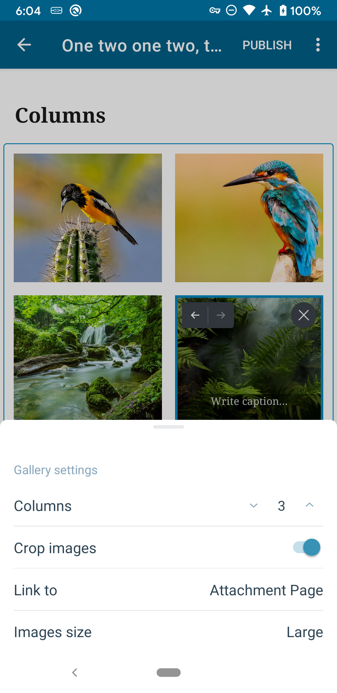
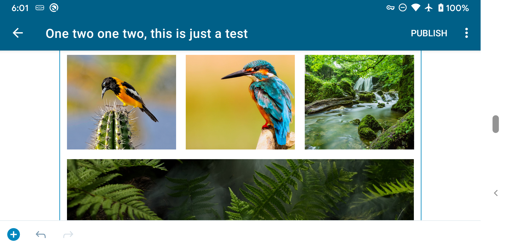
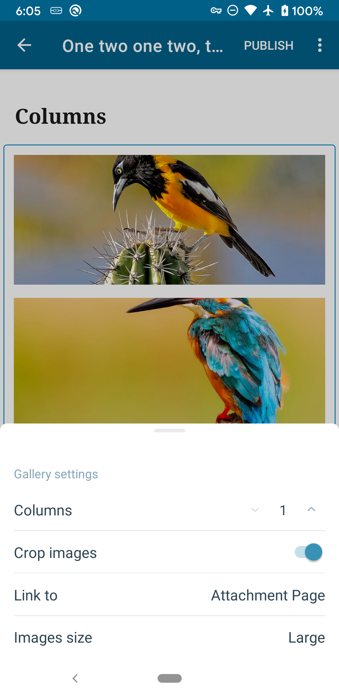
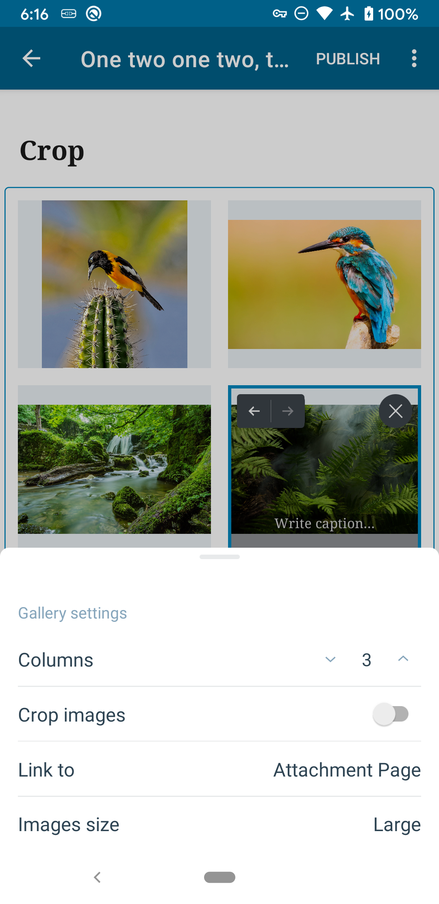

# Gallery Block - Test Cases

#### **Precondition**

A site with premium or business plan

--------------------------------------------------------------------------------

##### TC001

### Close/Re-open post with an ongoing image upload

Gallery block should continue normally if the editor is closed and re-opened with ongoing uploads.

**Steps:**

* Add a gallery block and tap "Add Media"
* Select "Choose from device" option
* Select multiple images from the device and confirm the selection
* While image are uploading, leave the editor
* Verify that you see the upload progress in post summary:
  * 
* Re-open the post with the gallery block before uploads complete

**Expected behavior:**

* Gallery should show all images being uploaded as dimmed
* Progress bars should be displayed indicating the upload progress
* After each image upload has completed:
  * Image should not be dim
  * Image url scheme should be `https://` (not `file:///`) in HTML mode

--------------------------------------------------------------------------------

##### TC002

### Close post with an ongoing image upload

Gallery block should allow uploading multiple images after the editor is closed.

**Steps:**

* Add a gallery block and tap "Add Media"
* Select "Choose from device" option
* Select multiple images from the device and confirm the selection
* While image are uploading, leave the editor
* Verify that you see the upload progress in post summary:
  * 
* Wait for uploads to complete while in the post list
* Re-open the post with the gallery block

**Expected behavior:**

* Gallery should show all completed uploads
* The images' url schemes should be `https://` (not `file:///`) in HTML mode

--------------------------------------------------------------------------------

##### TC005

### Choose from device (stay in editor) - Successful upload

Gallery block should allow uploading multiple images from the device.

**Steps:**

* Add a gallery block and tap "Add Media"
* Select "Choose from device" option
* Select multiple images from the device and confirm the selection

**Expected behavior:**

* Gallery should show all images being uploaded as dimmed
* Progress bars should be displayed indicating the upload progress
* After each image upload has completed:
  * Image should not be dim
  * Image url scheme should be `https://` (not `file:///`) in HTML mode

--------------------------------------------------------------------------------

##### TC006

### Choose from device (stay in editor) - Failed upload

Gallery block should allow retrying failed uploads

**Steps:**

* Add a gallery block and tap "Add Media"
* Select "Choose from device" option
* Select multiple images from the device and confirm the selection
* While images are uploading, turn on airplane mode

**Expected behavior:**

* Images should indicate failed upload state
* Tapping a failed image should provide an option to retry the upload(s)

--------------------------------------------------------------------------------

##### TC007

### Take a photo

Gallery block should allow uploading images from the camera.

**Steps:**

* Add a gallery block and tap "Add Media"
* Select "Take a photo" option
* Take a photo and confirm the selection

**Expected behavior:**

* Gallery should show the image being uploaded as dimmed
* A progress bar should be displayed indicating the upload progress
* After the image upload has completed:
  * Image should not be dim
  * Image url scheme should be `https://` (not `file:///`) in HTML mode

--------------------------------------------------------------------------------

##### TC008

### Choose from the free photo library

Gallery block should allow uploading images from the free photo library.

**Steps:**

* Add a gallery block and tap "Add Media"
* Select "Choose from the free photo library" option
* Select multiple images from the device and confirm the selection

**Expected behavior:**

* Gallery should show all images being uploaded as dimmed
* Progress bars should be displayed indicating the upload progress
* After each image upload has completed:
  * Image should not be dim
  * Image url scheme should be `https://` (not `file:///`) in HTML mode

--------------------------------------------------------------------------------

##### TC009

### Choose from device (stay in editor) - Cancel upload

Gallery block should allow canceling image uploads.

**Known issues:**

* Cancelling an upload leaves an empty placeholder block, which can leave an empty space on the front-end. Reported in https://github.com/WordPress/gutenberg/issues/39612.

**Steps:**

* Add a gallery block and tap "Add Media"
* Select "Choose from device" option
* Select an image from the device and confirm the selection
* While the image is uploading, tap the image

**Expected behavior:**

* A prompt for "Stop uploading" should be shown.
* Confirming should cancel the upload if the upload didn't finish.
* Declining should allow the upload to continue.  

--------------------------------------------------------------------------------

##### TC011

### Choose from Other Apps (iOS Files App)

Gallery block should allow uploading images from the iOS Files app.

**Steps:**

* Add a gallery block and tap "Add Media"
* Select "Other Apps" option
* Select multiple images from the Files app

**Expected behavior:**

* Gallery should show all images being uploaded as dimmed
* Progress bars should be displayed indicating the upload progress
* After each image upload has completed:
  * Image should not be dim
  * Image url scheme should be `https://` (not `file:///`) in HTML mode

--------------------------------------------------------------------------------

##### TC013

### Settings - Columns

Gallery block should display images in columns, limited to 2 in portrait

**Steps:**

* Add a gallery block and tap "Add Media"
* Add some images from the media library (at least 3)
* Tap the block settings icon ⚙️ :gear:
* Tap `Columns` setting
* Set columns to 3 (might be the default)
* Observe visible columns
* Rotate to landscape orientation
* Observe visible columns

**Expected behavior:**

In portrait, a maximum of 2 columns are visible (even when set to 3)
In landscape, 3 columns are visible
Images in the last row expand horizontally to fill the width of the block

Portrait | Landscape
-|-
 | |

* Rotate to portrait
* Set columns to 1
* Observe visible columns

**Expected behavior:**

In portrait, 1 columns is visible
Images expand horizontally to fill the width of the block

--------------------------------------------------------------------------------

##### TC014

### Settings - Crop images

Gallery block should allow cropped or uncropped images

**Steps:**

* Add a gallery block and tap "Add Media"
* Add some images from the media library (at least 3)
* Tap the block settings icon ⚙️ :gear:
* Tap `Crop` setting (to toggle crop off)

**Expected behavior:**

Gallery should show all images fully (uncropped)

