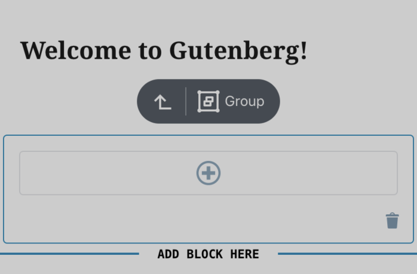
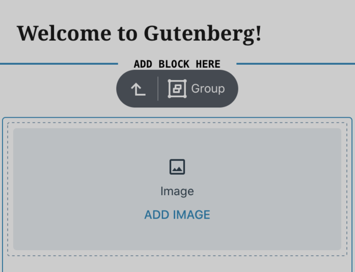
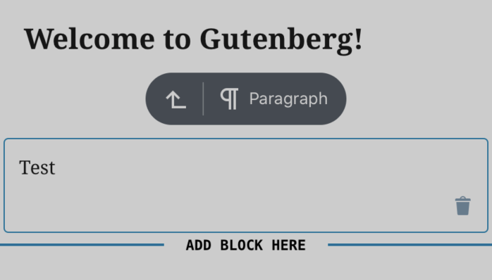
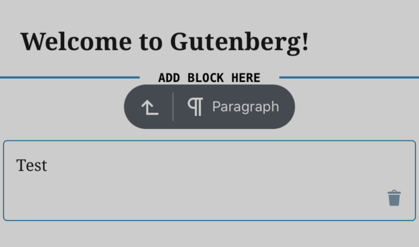
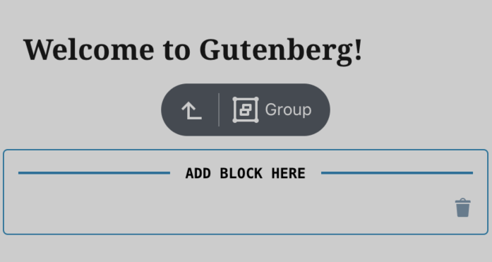
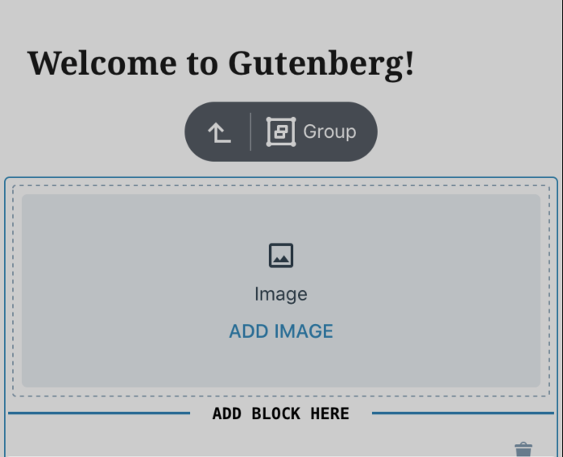
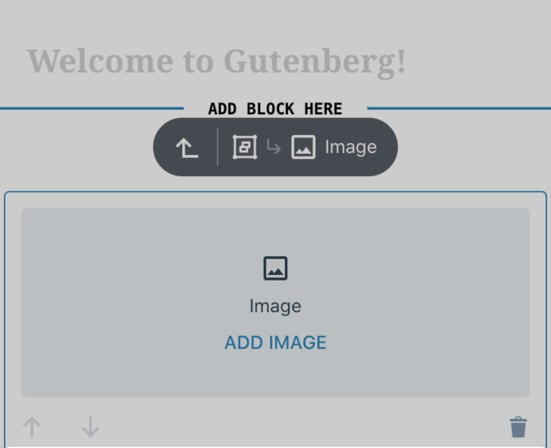
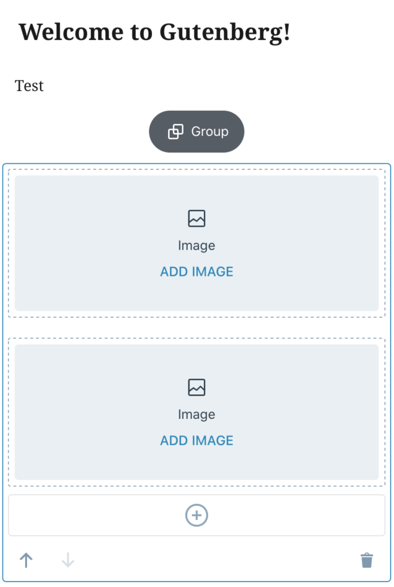
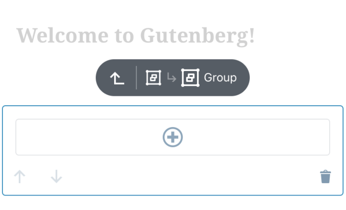

# Group Block - Test Cases

--------------------------------------------------------------------------------

##### TC001

### AppenderButton is render properly

-   Add a `Group` block
-   Check if `AppenderButton` is rendered
-   Add another block inside `Group` and deselect
-   Check if `AppenderButton` is align with the content

Expected look:  

--------------------------------------------------------------------------------

##### TC002

### DefaultAppender allows to open Inserter and add block outside the group

-   Add a `Group` block
-   Having `Group` block selected press on `DefaultAppender`
-   Check if the block is added outside after the `Group`

Expected look:  

-   Having `Group` block selected long press on `DefaultAppender`
-   Select where you want to add block after or before
-   Check if the block is added outside after/before the `Group`

Expected look:  

--------------------------------------------------------------------------------

##### TC003

### Deep nesting is possible (iOS only)

-   Add a `Group` block
-   Nest blocks inside multiple `Group` blocks (at least 3 levels deep)
-   Check if app do not crashes

--------------------------------------------------------------------------------

##### TC004

### Check if Group placeholder is render on RootList

-   Add a `Group` block
-   Deselect
-   Check if you are able to see `Group` placeholder

Expected look:  

--------------------------------------------------------------------------------

##### TC005

### Check if Group placeholder is render in nested structure

-   Add a `Group` block
-   Nest some `Group` inside
-   Select top-most `Group` block in hierarchy
-   Check if you are able to see `Group` placeholder of nested blocks wrapped with dashed border
-   Go down in the hierarchy observing if margins is keept (the whole UI should remain the same)
-   After selecting last `Group` you should be able to see it's `AppenderButton`

Expected look:  

  

--------------------------------------------------------------------------------

##### TC006

### Insertion point (Separator) is show in correct place in RootList

-   Open new post
-   See if "Start writing" prompt is visible
-   Press `DefaultAppender`
-   Check if `Separator` is visible right below the title block
-   Check if "Start writing" prompt is not visible

Expected look:  

-   Open new post
-   Type some text in the "Start writing" prompt
-   Press `DefaultAppender`
-   Check if `Separator` is visible right below the `Paragraph` block

Expected look:  

-   Add a `Group` block
-   Long press `DefaultAppender`
-   Select where you want to add block after or before
-   Check if the `Separator` is render outside before/after the `Group`

Expected look:  

--------------------------------------------------------------------------------

##### TC007

### Insertion point (Separator) is show in correct place in Group

-   Add a `Group` block
-   Press group `AppenderButton ( + )`
-   Check if the `Separator` is render instead of `AppenderButton`

Expected look:  

-   Add a `Group` block
-   Add block inside
-   Select `Group` block
-   Press group `AppenderButton ( + )`
-   Check if the `Separator` is render after last block in the `Group`

Expected look:  

-   Add a `Group` block
-   Add block inside and keep newly added block selected
-   Press `AppenderButton ( + )`
-   Select where you want to add block after or before
-   Check if the `Separator` is render after/before selected block in the `Group`

Expected look:  

--------------------------------------------------------------------------------

##### TC008

### Nested block have proper border styling

-   Add a `Group` block
-   Nest some blocks inside
-   Check if each selected block gets solid blue border
-   Check if each first child gets dashed grey border
-   Check if margins and paddings do not bounce when changing selection (exception is the trasition of the selected block connected with making space for FloatingToolbar)
-   Check if there is no weird/unexpected extra free space around blocks

Expected look:  

--------------------------------------------------------------------------------

##### TC009

### Nested empty group block do not multiplicates margins

-   Add a `Group` block
-   Nest multiple empty `Group` block
-   Check if there is no extra margins applied when nested empty `Group` blocks

Expected look:  

--------------------------------------------------------------------------------

##### TC010

### Nested selection cause applying dimmed style on the rest of blocks

-   Add a `Group` block
-   Create some nested structure
-   Navigate down in the hierarchy
-   Check if each time you change selection all blocks that are higher in hierarchy tree gets dimmed
-   Select `Group` block
-   Check if none block gets dimmed

Expected look:  

  

  

--------------------------------------------------------------------------------

##### TC011

### No extra margins applied when nesting empty group blocks

-   Add new post
-   Add a `Group` block
-   Create some nested structure
-   Select nested block to make some block gets dimmed
-   Close post
-   Reopen post
-   Check if there is no block beeing selected and dimmed

--------------------------------------------------------------------------------

##### TC012

### FloatingToolbar is render when group or it's child is selected

-   Add a `Group` block
-   Prepare nested structure
-   Check if each time you select any block it renders `FloatingToolbar` above

Expected look:  

  

--------------------------------------------------------------------------------

##### TC013

### Breadcrumbs on FloatingToolbar is properly displayed

-   Add a `Group` block
-   Create nested structure
-   Check if each time you change selection `Breadcrumbs` show proper block title and icon 
-   Check if each time you change selection `Breadcrumbs` show proper parent block
-   Check if `Breadcrumbs` renders navigation up button

Expected look:  

  

--------------------------------------------------------------------------------

##### TC014

### Navigation up works as expected

-   Add a `Group` block
-   Create nested structure
-   Select deep nested block
-   Press navigation up button on `Breadcrumb`
-   Check if each time you press navigation up button the selection moves to parent block
-   Check if border and dim styles changes accordingly

--------------------------------------------------------------------------------

##### TC015

### Navigation down works as expected

-   Add a `Group` block
-   Create some nested structure ( at least 3 levels deep )
-   Clear selection
-   Press on the bottom-most block in hierarchy of added `Group`
-   Check if the selection is redirect properly to top-most parent
-   Repeat - press on the bottom-most block in hierarchy of added `Group`
-   Check if each time you press nested block you move selection one level down (block which gets selection should be common ancestor with previously selected block and pressed block)

--------------------------------------------------------------------------------

##### TC016

### Navigation in hierarchy works as expected

-   Add a `Group` block
-   Create some nested structure ( at least 3 levels deep )
-   Select nested block
-   Having nested block selected try to select block which is higher in the hierarchy (one, two and more levels above)
-   Check if that block gets selected after press

--------------------------------------------------------------------------------

##### TC017

### Mover arrows changes the order of blocks in group

-   Add a `Group` block
-   Create nested structure
-   Check if using mover arrows change the order of blocks in `Group` as expected 

--------------------------------------------------------------------------------

##### TC018

### Delete button removes the block from group and group block

-   Add a `Group` block
-   Create nested structure
-   Selecting nested blocks
-   Check if `Delete` button removes the selected block
 
-   Select `Group`
-   Check if `Delete` button removes the whole `Group` and it's children

--------------------------------------------------------------------------------

##### TC019

### Ungroup button works as expected

-   Add a `Group` block
-   Add blocks to `Group`
-   Select `Group` block
-   Press `Ungroup` button on the `MobileToolbar`
-   Check if `Group` block was delete and all of it's child are able to select directly after press

--------------------------------------------------------------------------------

##### TC020

### New block added to group gets focus immedately

-   Add a `Group` block
-   Add new block through `DefaultAppender`
-   Check if block gets focus after add
-   Add new block through `AppenderButton`
-   Check if block gets focus after add

--------------------------------------------------------------------------------

##### TC021

### Check if in DarkMode all components gets proper colors (iOS)

-   Add a `Group` block
-   Create nested structure
-   Switch to DarkMode (iOS)
-   Check if all components switch it's color schema to dark

--------------------------------------------------------------------------------
