# Group Block - Test Cases

--------------------------------------------------------------------------------

##### TC001

### AppenderButton is rendered

-   Add a `Group` block
-   Check if `AppenderButton` is rendered
-   Add another block inside `Group` and deselect
-   Check if `AppenderButton` is align with the content

Expected look:  
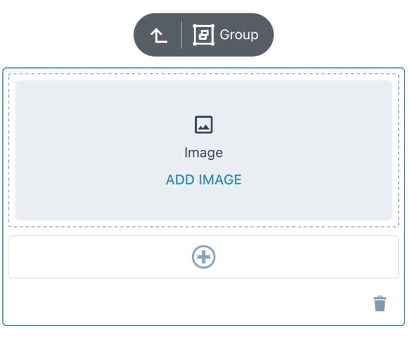

--------------------------------------------------------------------------------

##### TC002

### Deep nesting is possible (iOS only)

-   Add a `Group` block
-   Nest blocks inside multiple `Group` blocks (at least 3 levels deep)
-   Check if app do not crash

--------------------------------------------------------------------------------

##### TC003

### Check if Group placeholder is visible for the unselected state

-   Add a `Group` block
-   Deselect
-   Check if you are able to see `Group` placeholder

Expected look:  
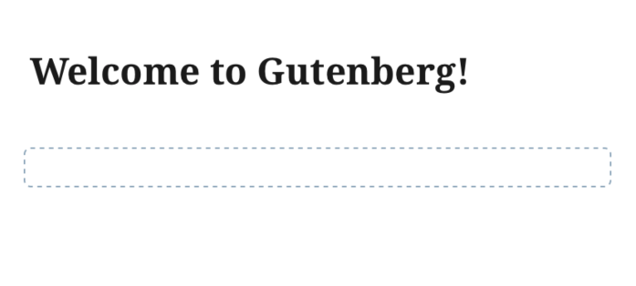

--------------------------------------------------------------------------------

##### TC004

### Check if Group placeholder is render in nested structure

-   Add a `Group` block
-   Nest some `Group` inside
-   Select top-most `Group` block in hierarchy
-   Check if you are able to see `Group` placeholder of nested blocks wrapped with dashed border
-   Go down in the hierarchy observing if margins is keept (the whole UI should remain the same)
-   After selecting last `Group` you should be able to see it's `AppenderButton`

Expected look:  
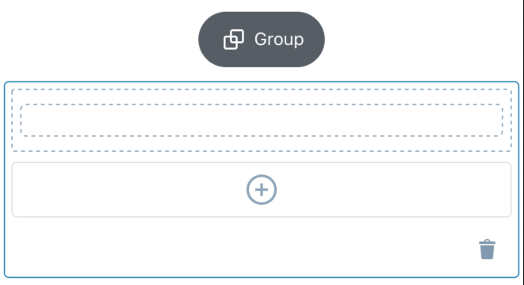
 - Post title is not dimmed
 - Navigation arrows is not visible
 - Only selected block title and icon is visible in breadcrumbs

 - Post title is dimmed
 - Navigation arrows is visible
 - Navigation arrows are disable depending on order in block
 - Show parent in breadcrumbs

--------------------------------------------------------------------------------

##### TC005

### Nested block have proper border styling

-   Add a `Group` block
-   Nest some blocks inside
-   Check if each selected block gets solid blue border
-   Check if each first child gets dashed grey border

Expected look:  
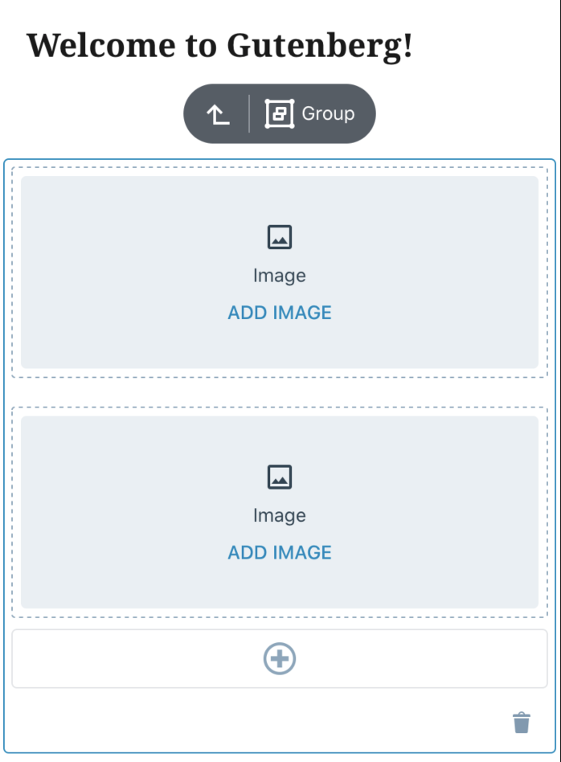

--------------------------------------------------------------------------------

##### TC006

### Nested block have proper margins values

-   Add a `Group` block
-   Nest some blocks inside
-   Check if space aroun blocks do not bounce when changing selection (exception is the trasition of the selected block connected with making space for FloatingToolbar)
-   Check if there is no weird/unexpected extra free space around blocks
-   Check the spaces values

Expected look:  

 - Space of `3px` left/right (between screen edge and solid border)

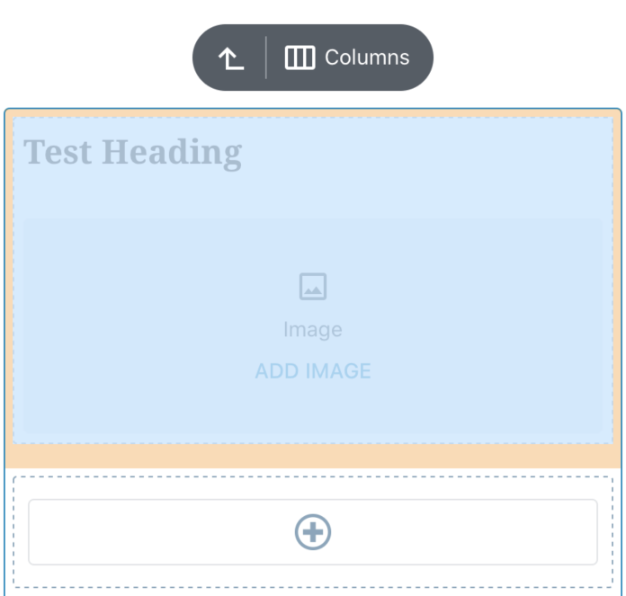
 - Space of `5px` left/right (beetwen dashed border and solid border)

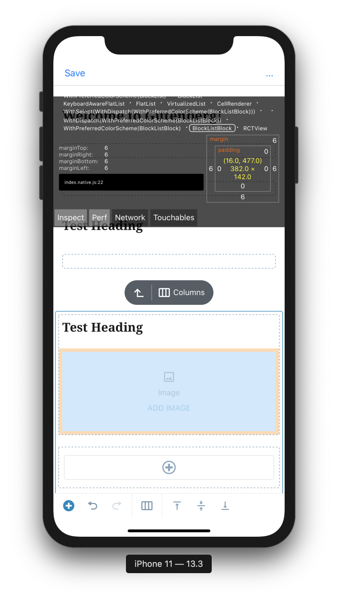
 - Space of `6px` left/right (beetwen content and dashed border)

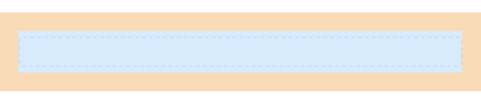
 - Space of `16px` left/right

Total space from screen edge to content should equals `16px` in each state (including solid and dashed border width in selection state)

--------------------------------------------------------------------------------

##### TC007

### Nested selection cause applying dimmed style on the rest of blocks

-   Add a `Group` block
-   Create some nested structure
-   Navigate down in the hierarchy
-   Check if each time you change selection all blocks that are higher in hierarchy tree gets dimmed
-   Select `Group` block
-   Check if none block gets dimmed

Expected look:  
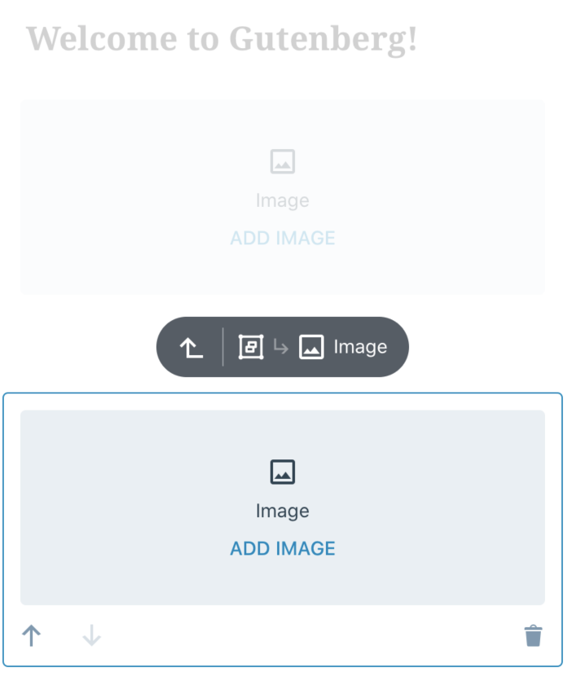
  
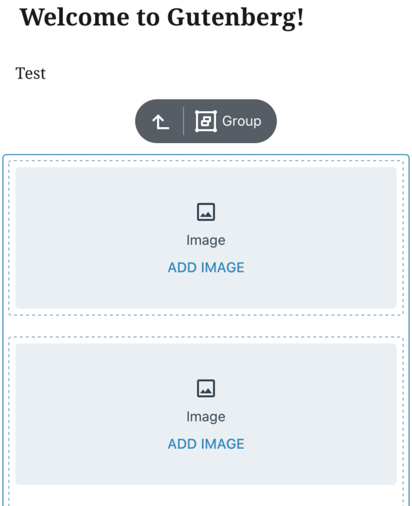
  
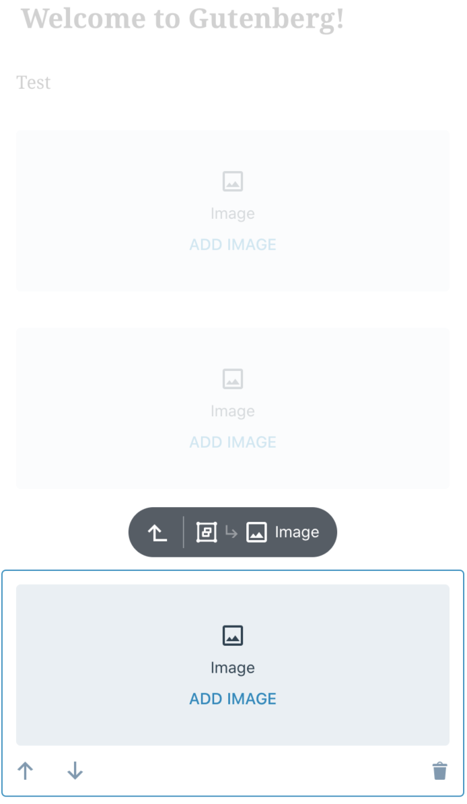

--------------------------------------------------------------------------------

##### TC008

### Breadcrumbs on FloatingToolbar is properly displayed

-   Add a `Group` block
-   Create nested structure
-   Check if each time you change selection `Breadcrumbs` show focused block title and focused block icon
-   Check if each time you change selection `Breadcrumbs` show top most parent block icon
-   Check if `Breadcrumbs` renders navigation up button

Expected look:  
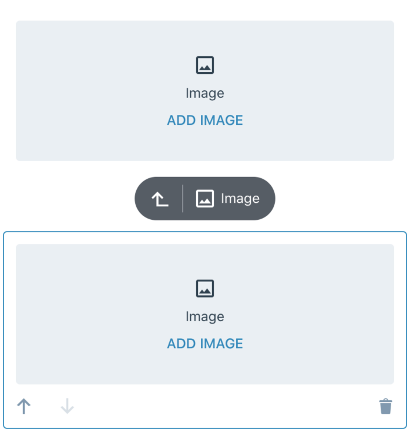
  
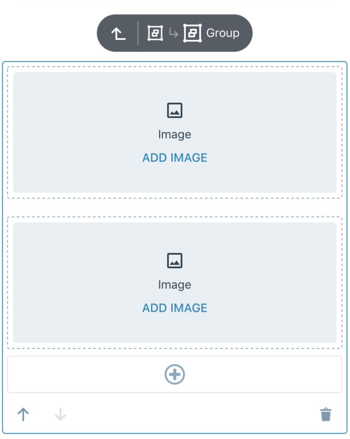

--------------------------------------------------------------------------------

##### TC009

### Navigation up button works as expected

-   Add a `Group` block
-   Create nested structure
-   Select deep nested block
-   Press navigation up button on `Breadcrumb`
-   Check if each time you press navigation up button the selection moves to parent block
-   Check if border and dim styles changes accordingly

--------------------------------------------------------------------------------

##### TC010

### Navigation down works as expected

-   Add a `Group` block
-   Create some nested structure ( at least 3 levels deep )
-   Clear selection
-   Press on the bottom-most block in hierarchy of added `Group`
-   Check if the selection is redirect properly to top-most parent
-   Repeat - press on the bottom-most block in hierarchy of added `Group`
-   Check if each time you press nested block you move selection one level down (block which gets selection should be common ancestor with previously selected block and pressed block)

--------------------------------------------------------------------------------

##### TC011

### Cross navigation between blocks works as expected

-   Add a `Group` block
-   Create some nested structure ( at least 3 levels deep )
-   Select nested block
-   Having nested block selected try to select block which is higher in the hierarchy (one, two and more levels above)
-   Check if that block gets selected after press

--------------------------------------------------------------------------------

##### TC012

### Ungroup button works as expected

-   Add a `Group` block
-   Add blocks to `Group`
-   Select `Group` block
-   Press `Ungroup` button on the block toolbar
-   Check if `Group` block was deleted and each child block can now be selected directly

--------------------------------------------------------------------------------

##### TC013

### Check if in DarkMode all components gets proper colors (iOS)

-   Add a `Group` block
-   Create nested structure
-   Switch to DarkMode (iOS)
-   Check if all components switch it's color schema to dark

Expected look:  
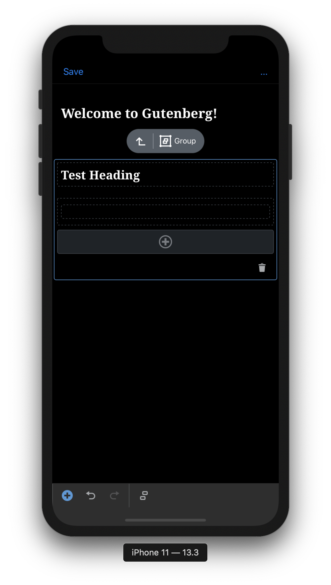

--------------------------------------------------------------------------------
