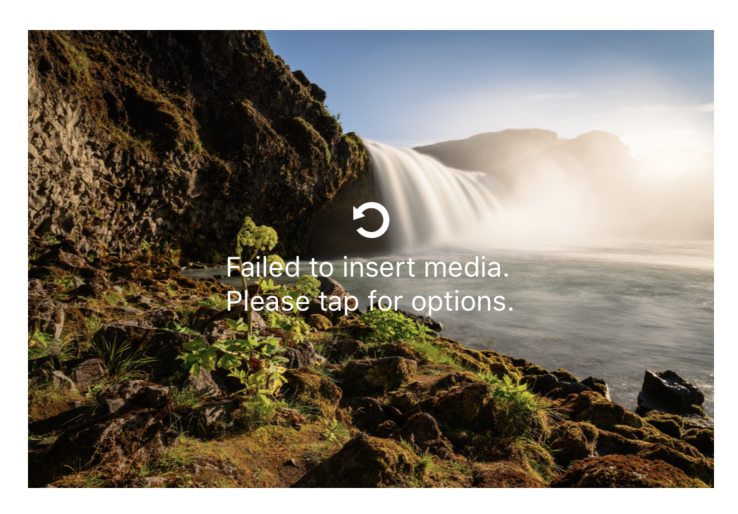
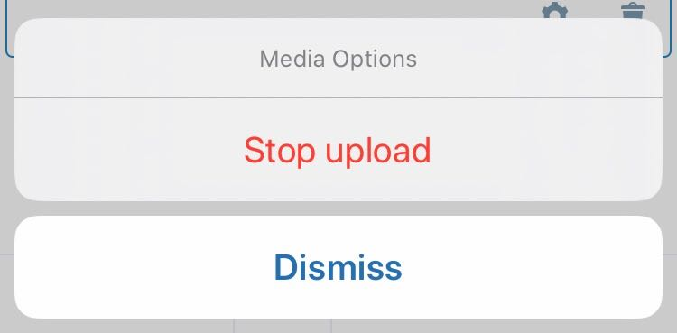
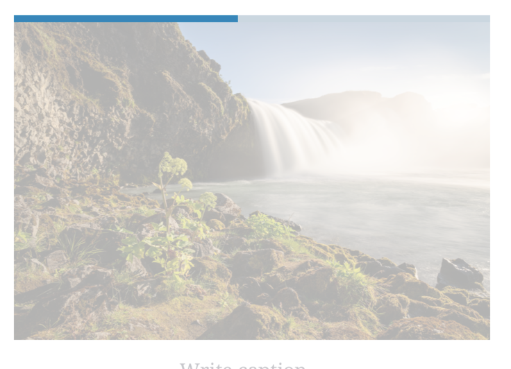
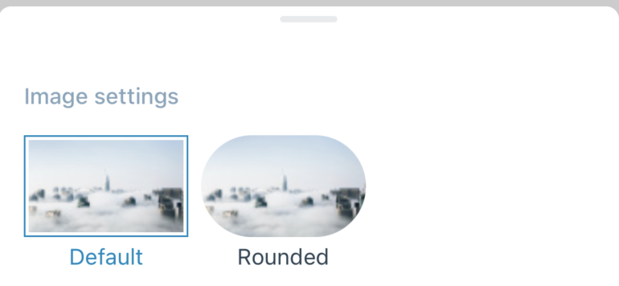
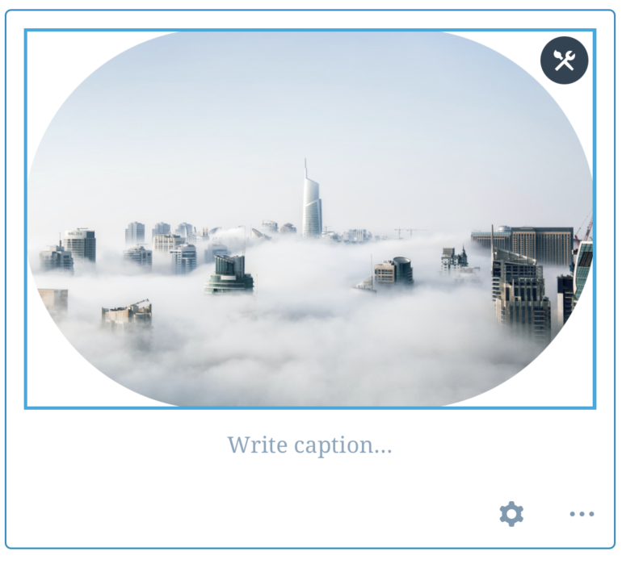

# Image Block - Test Cases

#### **Precondition**

A site with premium or business plan

##### TC001

**Insert image from device (failing)**

-   Tap on the Image block placeholder or edit button in the toolbar
-   Tap option ‘Choose from device’ and choose an image
-   Turn off internet connection and wait
-   You should see the retry message on the image thumbnail
 
-   Turn your internet connection back on
-   Tap on the image
-   You should be asked to retry
 
-   Tap retry
-   The upload should continue

--------------------------------------------------------------------------------
##### TC002

**Insert image from device (stop)**

-   Tap on the Image block placeholder or edit button in the toolbar
-   Tap option ‘Choose from device’ and choose an image
-   While the upload is in progress tap on the image thumbnail
-   You should see the below message:
 
-   Tap Stop
-   You should see the image block is cleared and placeholder is again visible

--------------------------------------------------------------------------------
##### TC003

**Add Caption**

-   Add a caption to the image block and save the post
-   Reopen the post
-   Verify caption text is there

--------------------------------------------------------------------------------
##### TC004

**Close/Re-open post with an ongoing image upload**

-   Add an image block and insert image from device
-   While there’s an ongoing upload, close the post with publishing changes
-   Verify that you see the upload progress in post summary
 
-   Reopen the post while upload is ongoing
-   Verify you see the upload progress in the image block
 

--------------------------------------------------------------------------------
##### TC005

**Close post with an ongoing image upload**

-   Add an image block and insert image from device
-   While there’s an ongoing upload, close the post with publishing changes
-   Verify that you see the upload progress in post summary
 
-   Wait until upload finishes
-   Re-open the post
-   Verify that Image block shows the uploaded image

--------------------------------------------------------------------------------
##### TC006

**Border style setting**

**Steps**
-   Add an image block and insert image
-   Open the block's settings
-   Check the border style options are shown correctly:
 
-   Select the `Rounded` border style
-   Close the settings

**Expected Behavior**

-   The image should show the selected border style:
 

--------------------------------------------------------------------------------
##### TC007

**Image size setting**

(Note: option not available for hotlinked images)

**Steps**
-   Add an image block and insert image
-   Open the block's settings
-   Change the size of the image
-   Close the settings

**Expected Behavior**

-   Sizes available should be: `Thumbnail`, `Medium`, `Large`, `Full Size`.
-   Selecting an image size should update the image size within the block

--------------------------------------------------------------------------------

##### TC008

**Link to setting**

**Steps**
-   Add an image block and insert image
-   Open the block's settings
-   Tap on `Link to`
-   Tap `Custom URL`
-   Type a URL and tap on `Apply`
-   Select the `Open in new tab` option
-   Close the settings

**Expected Behavior**

-   The `Link rel` value should update automatically to `noreferrer noopener` once the `Open in new tab` option is selected
-   Switching to `HTML Mode` should show the image block code with the selected link
