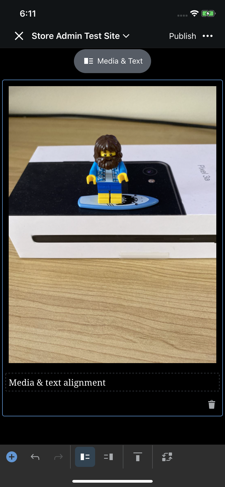
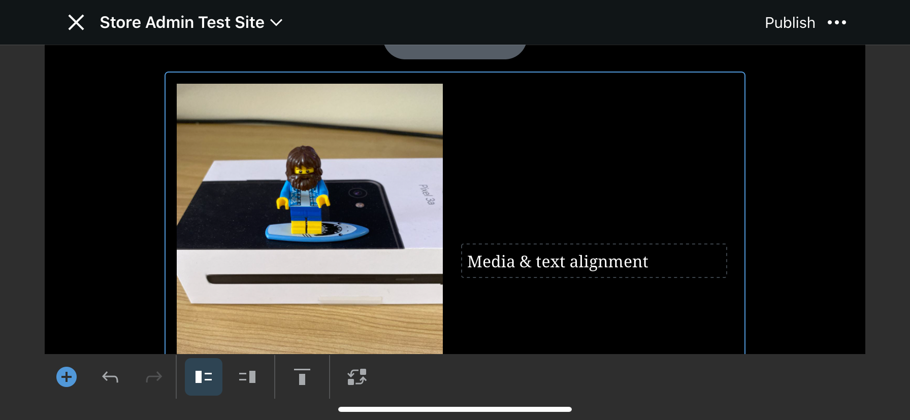
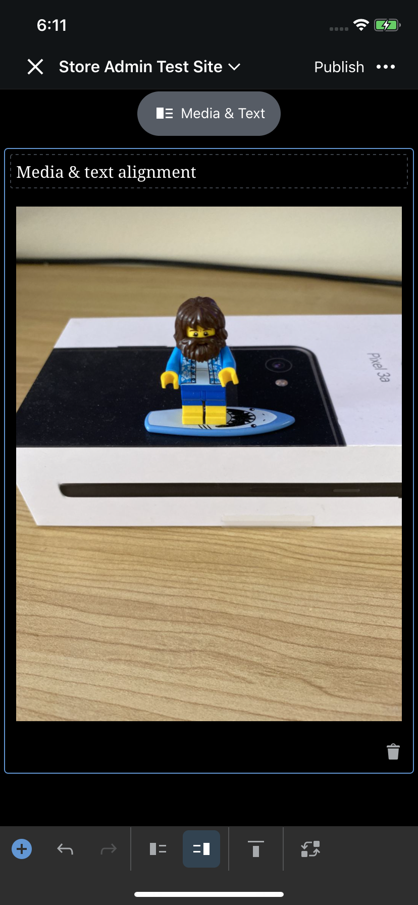
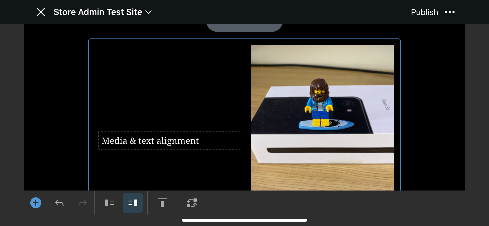
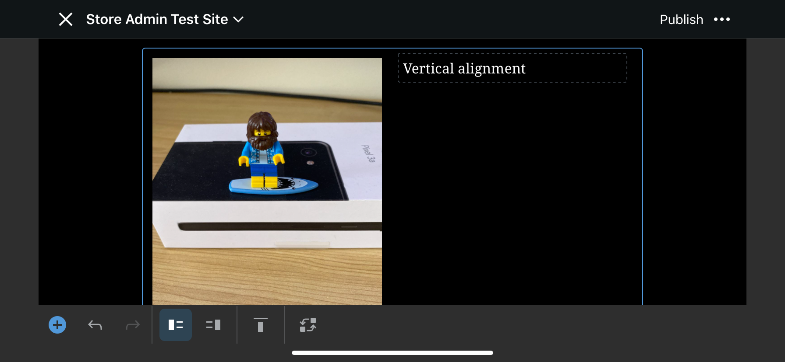
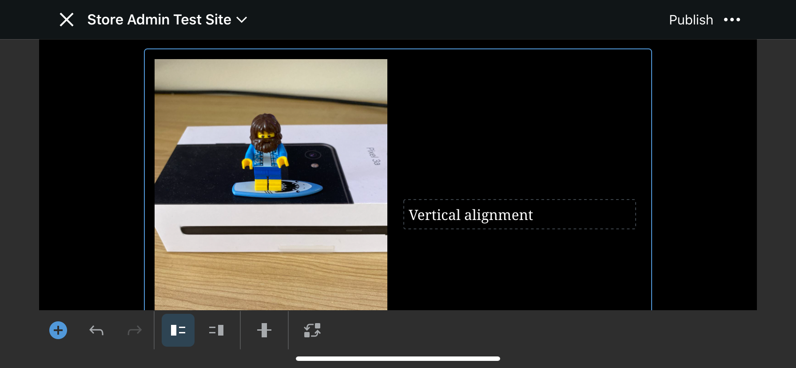
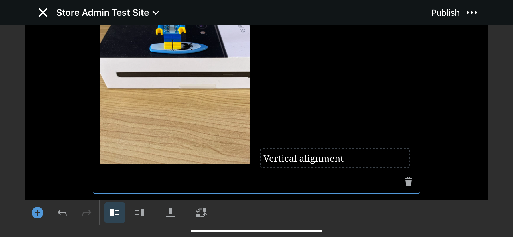

# Media-Text Block - Test Cases

--------------------------------------------------------------------------------

#### **Precondition**

Free or Personal plans are limited to videos that are less than five minutes in length. Currently, there is no size limitation other than the available storage on the user's site.

--------------------------------------------------------------------------------

##### TC001-i

**Insert image from device (failing)**

Use same same steps on Media-Text block: [image block TC001](https://github.com/wordpress-mobile/test-cases/blob/master/test-cases/gutenberg/image.md#tc001).

--------------------------------------------------------------------------------

##### TC001-v

**Insert video from device (failing)**

Use same same steps on Media-Text block: [video block TC001](https://github.com/wordpress-mobile/test-cases/blob/master/test-cases/gutenberg/video.md#tc001).

--------------------------------------------------------------------------------

##### TC002-i

**Insert image from device (cancel)**

Use same same steps on Media-Text block: [image block TC002](https://github.com/wordpress-mobile/test-cases/blob/master/test-cases/gutenberg/image.md#tc002) 

--------------------------------------------------------------------------------

##### TC002-v

**Insert video from device (cancel)**

Use same same steps on Media-Text block: [video block TC002](https://github.com/wordpress-mobile/test-cases/blob/master/test-cases/gutenberg/video.md#tc002) 

--------------------------------------------------------------------------------

##### TC003-i

**Close/Re-open post with an ongoing image upload**

Use same same steps on Media-Text block: [image block TC004](https://github.com/wordpress-mobile/test-cases/blob/master/test-cases/gutenberg/image.md#tc004)

--------------------------------------------------------------------------------

##### TC003-v

**Close/Re-open post with an ongoing video upload**

Use same same steps on Media-Text block: [video block TC004](https://github.com/wordpress-mobile/test-cases/blob/master/test-cases/gutenberg/video.md#tc004)

--------------------------------------------------------------------------------

##### TC004-i

**Close post with an ongoing image upload**

Use same same steps on Media-Text block: [image block TC005](https://github.com/wordpress-mobile/test-cases/blob/master/test-cases/gutenberg/image.md#tc005) 

--------------------------------------------------------------------------------

##### TC004-v

**Close post with an ongoing video upload**

Use same same steps on Media-Text block: [video block TC005](https://github.com/wordpress-mobile/test-cases/blob/master/test-cases/gutenberg/video.md#tc005)

--------------------------------------------------------------------------------

##### TC005-i

**Change media text order during upload and close the post**

- Add media-text
- Start an image upload
- Change media-text order using the toolbar button.
- Leave the post before upload finishes
- Wait until upload is finished
- Reopen the post
- Verify that Media Text block shows the uploaded image

--------------------------------------------------------------------------------

##### TC006

### Media & Text alignment

1. Add a Media & Text block
2. Add an image from the media library
3. Add some text
4. Tap the media & text alignment buttons to switch their order
5. Rotate the device to landscape mode
6. Repeat step 4

**Expected:**

The media and text should change positions based on the alignment setting.

Screenshots

Setting | Portrait | Landscape
-|-|-
Media first |  | 
Text first |  | 

--------------------------------------------------------------------------------

##### TC007

### Vertical alignment

1. Add a Media & Text block
2. Add an image from the media library
3. Add some text
4. Rotate the device to landscape mode
5. Tap the vertical alignment button and try each of the settings
   1. Tap "Vertically Align Top"
   2. Tap "Vertically Align Middle"
   3. Tap "Vertically Align Bottom"

**Expected:**

The text should vertically align beside the image based on the setting.

Screenshots

Setting | Screenshot
-|-
Vertically Align Top| 
Vertically Align Middle| 
Vertically Align Bottom| 

