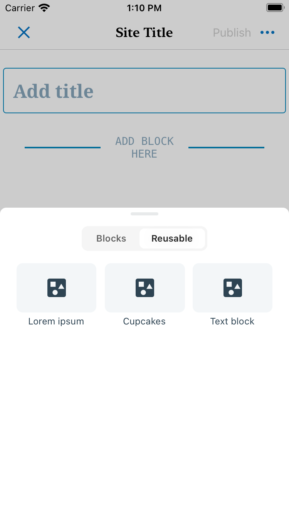
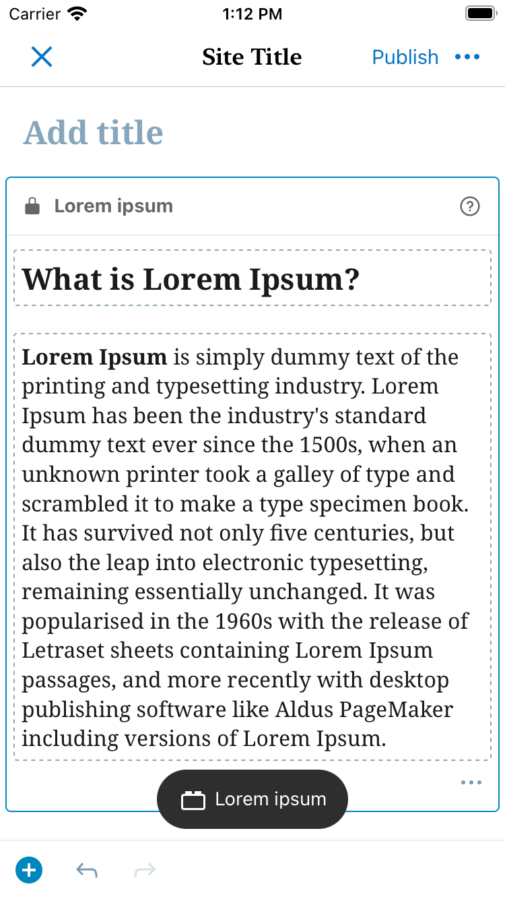
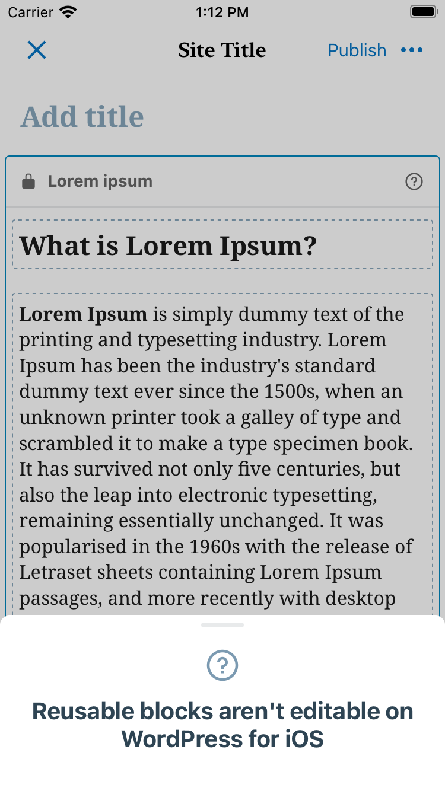
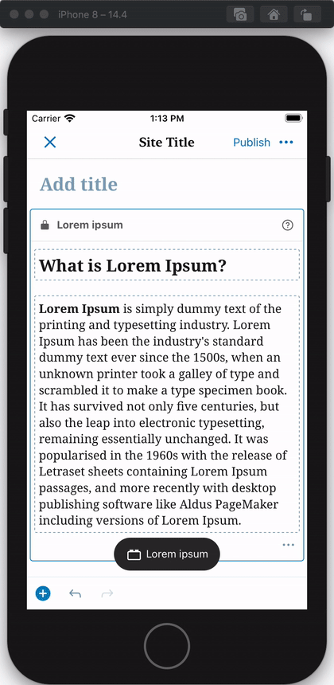
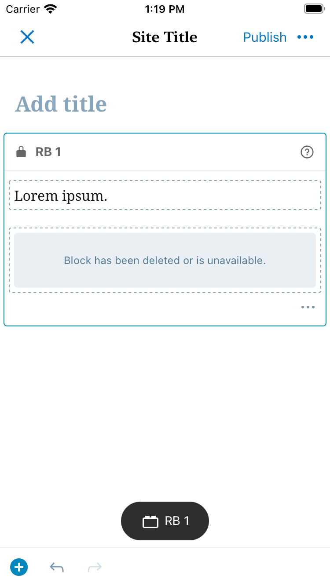
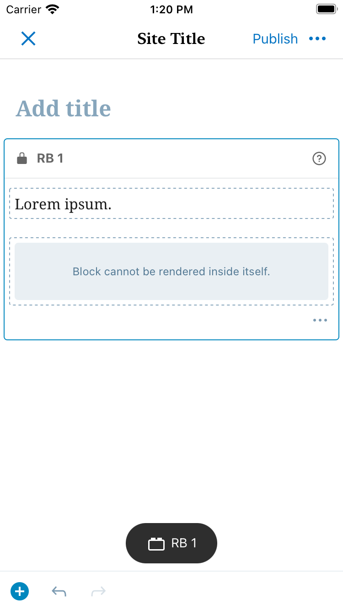

# Reusable Block - Test Cases

## Preparation

**For testing this block, it's required to create reusable blocks via the web version, here are the steps:**

- Navigate to reusable blocks page (URL: `https://wordpress.com/types/wp_block/<YOUR_WPCOM_SITE_DOMAIN>`).
- Click on "Add new reusable block".
- Add a title.
- Add some blocks.
- Publish it.

The reusable blocks page can be also used for editing and deleting blocks.

##### TC001

**Add block**

**Steps**
- Tap on :plus: button.
- Tap on "Reusable" tab
- Tap on a reusable block
- Once inserted, tap on the block

**Expected Behavior**
- Expect to see the reusable block and its content.
- Epxect to see the block's name in the block's header.

<kbd></kbd>
<kbd></kbd>

- Expect to see a warning message when trying to edit the block.

<kbd></kbd>

--------------------------------------------------------------------------------

##### TC002

**Convert to regular blocks**

**Steps**
- Open the block settings.
- Tap on "Convert to regular blocks".

**Expected Behavior**
- Expect to see the content of the block as individual blocks.

<kbd></kbd>

**Next Steps**

- Tap the undo button.

**Expected Behavior**
- Expect to restore the reusable block.

<kbd></kbd>

**Next Steps**

- Tap the redo button.

**Expected Behavior**
- Expect to see the same blocks as after the conversion.

<kbd></kbd>

--------------------------------------------------------------------------------

##### TC003

**Deleted reusable block**

**Steps**
- Create two reusable blocks.
- Add the second reusable block as part of the content of the first one and update it.
- Delete the second reusable block from the "Reusable blocks page" (referenced above).
- The second reusable block will go to the trashed tab, delete it permanently.
- Add the first reusable block to a post/page.

**Expected Behavior**
- Expect to see a warning box within the reusable block content referencing the deleted block.

<kbd></kbd>

--------------------------------------------------------------------------------

##### TC004

**Recursive block rendering**

**Steps**

- Create a reusable block.
- Edit the reusable block, add the same reusable block as part of the content and update it.
- Add the reusable block to a post/page.

**Expected Behavior**

- Expect to see a warning box within the reusable block content instead of rendering multiple times the same block.

<kbd></kbd>