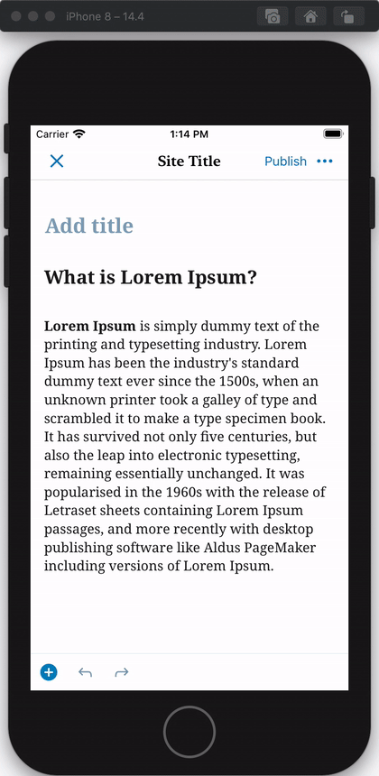
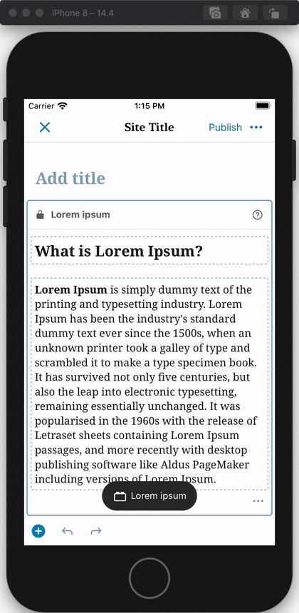

# Reusable Block - Test Cases

## Preparation

**For testing this block, it's required to create reusable blocks via the web version, here are the steps:**

- Navigate to the [reusable blocks page](https://wordpress.com/types/wp_block).
- Select the WP.com site for testing.
- Click on "Add new reusable block".
- Add a title.
- Add some blocks.
- Publish it.

The reusable blocks page can be also used for editing and deleting blocks.

##### TC001

**Add block**

**Steps**
- Tap on ➕ button.
- Tap on "Reusable" tab.
- Tap on a reusable block.
- Once inserted, tap on the block to edit it.

**Expected Behavior**
- Expect to see the reusable block and its content.
- Expect to see the block's name in the block's header.

<kbd></kbd>
<kbd></kbd>

- Expect to see a warning message when trying to edit the block.

<kbd></kbd>

--------------------------------------------------------------------------------

##### TC002

**Convert to regular blocks**

**Steps**
- Open the block settings.
- Tap on "Convert to regular blocks".

**Expected Behavior**
- Expect to see the content of the block as individual blocks.

<kbd></kbd>

**Next Steps**

- Tap the undo button.

**Expected Behavior**
- Expect to restore the reusable block.

<kbd></kbd>

**Next Steps**

- Tap the redo button.

**Expected Behavior**
- Expect to see the same blocks as after the conversion.

<kbd></kbd>

--------------------------------------------------------------------------------

##### TC003

**Deleted reusable block**

**Steps**
- Navigate to the [reusable blocks page](https://wordpress.com/types/wp_block).
- Select the WP.com site for testing.
- Create two reusable blocks (you can find more info about creating a reusable block in the `Preparation` section).
- Add the second reusable block as part of the content of the first one and update it.
- Delete the second reusable block from the "Reusable blocks page" (referenced above).
- The second reusable block will go to the trashed tab, delete it permanently.
- Switch to mobile device for the last step.
- Add the first reusable block to a post/page.

**Expected Behavior**
- Expect to see a warning box within the reusable block content referencing the deleted block.

<kbd></kbd>

--------------------------------------------------------------------------------

##### TC004

**Recursive block rendering**

**Steps**

- Navigate to the [reusable blocks page](https://wordpress.com/types/wp_block).
- Select the WP.com site for testing.
- Create a reusable block (you can find more info about creating a reusable block in the `Preparation` section).
- Edit the reusable block, add the same reusable block as part of the content and update it.
- Observe that the block will show a warning box with text: `Block cannot be rendered inside itself.`.
- Switch to mobile device for the last step.
- Add the reusable block to a post/page.

**Expected Behavior**

- Expect to see a warning box (same as it's shown in the web version) within the reusable block content instead of rendering multiple times the same block.

<kbd></kbd>
