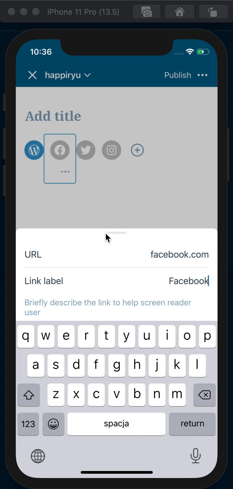
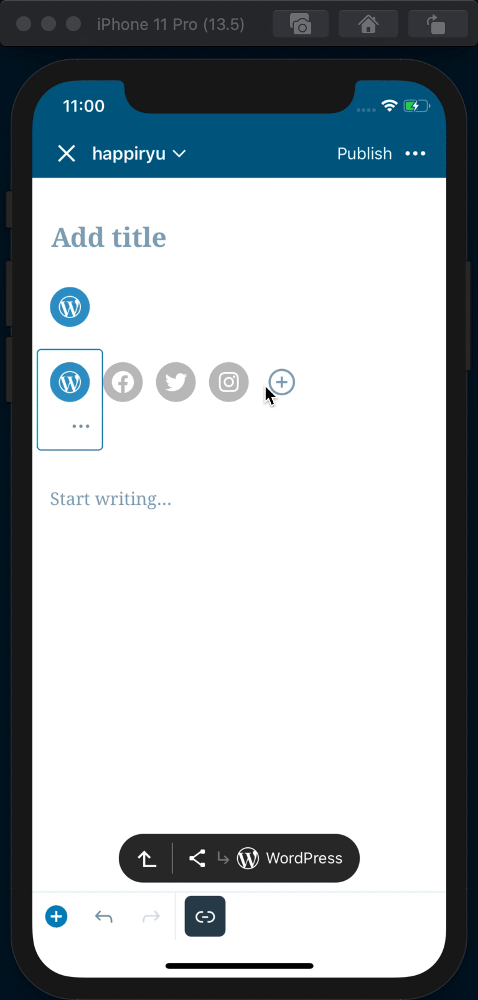
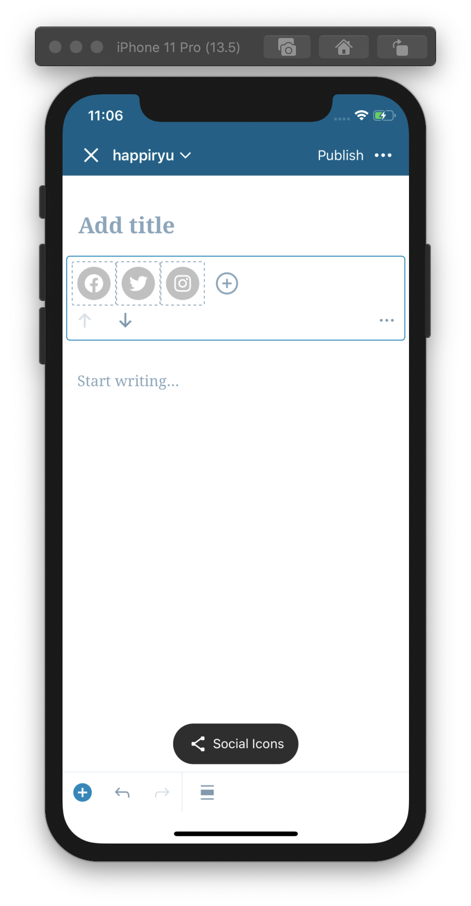
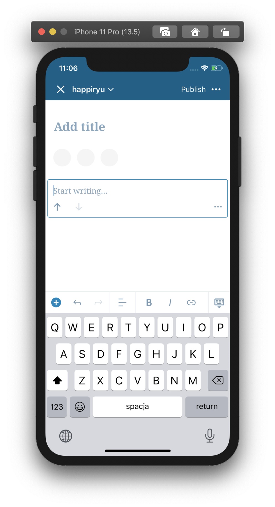

# Social Icons - Test Cases

--------------------------------------------------------------------------------

##### TC001

### The newly created `Social Icons` block is added with 4 icons

-   Add `Social Icons` block
-   Expect added 4 icons (WordPress, Facebook, Twitter, Instagram)
-   Expect WordPress icon to be active, already fulfilled with the link and to have product color

--------------------------------------------------------------------------------

##### TC002

### Active icon gets product color

-   Add `Social Icons` block
-   Press an inactive icon e.g. Facebook icon
-   Press `link` icon in mobile toolbar above the keyboard or tap the social icon
-   Fill `Label` field and add link into `URL` field e.g. facebook.com
-   Close the bottom sheet
-   Expect Facebook social icons to be active (has product color)
-   Expect icon color to be animated when closing bottom sheet

--------------------------------------------------------------------------------

##### TC003

### Only active icons are visible when not selected

-   Add `Social Icons` block
-   Select other block, e.g. `Paragraph`
-   Expect to have visible only active icons
-   Select `Social Icons` 
-   Expect to have visible both active and inactive icons

--------------------------------------------------------------------------------

##### TC004

### The link sheet is opened automatically when adding new icon

-   Add `Social Icons` block
-   Press an inserter or inline appender
-   Expect link sheet to be opened

--------------------------------------------------------------------------------

##### TC005

### Ghost placeholder is visible when no icon is active

-   Add `Social Icons` block
-   Remove WordPress icon
-   Expect _ghost_ placeholder to be visible

default | ghost placeholder
--- | ---
 | 

--------------------------------------------------------------------------------

##### TC006

### Social icon forwarding to the link

-   Add `Social Icons` block
-   Press an inserter or inline appender
-   Add new icon e.g. Amazon
-   Add link into `URL` field e.g. amazon.com
-   Close the bottom sheet
-   Open post preview
-   Press Amazon icon
-   Expect to be forwarded to the added link