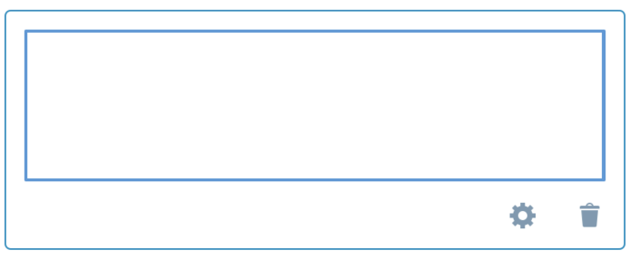
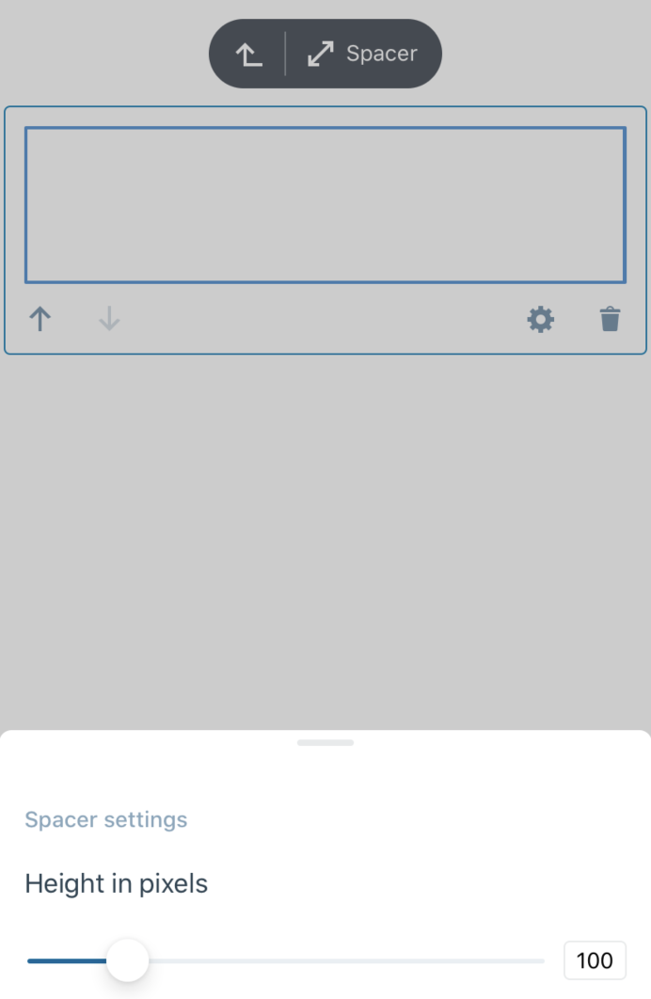
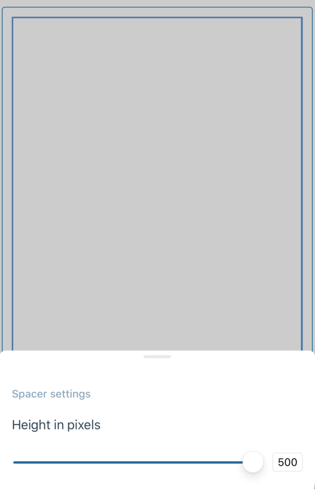
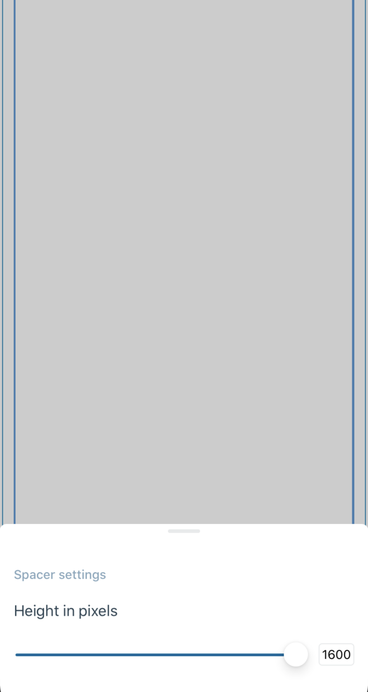

# Spacer Block - Test Cases

--------------------------------------------------------------------------------

##### TC001

### Spacer is rendered without crash

-   Add a `Spacer` block
-   Check if `Spacer` is rendered
-   Check if app does not crash when opening settings

Expected look:  


--------------------------------------------------------------------------------

##### TC002

### Settings: Control spacer height using the slider

-   Add a `Spacer` block
-   Check if `Spacer` block is rendered with default height of `100px`
-   Change slider value under `Spacer` settings to e.g. `300px`
-   Switch to HTML mode
-   Expect height to be `300px` in `Spacer` style:

```html
<!-- wp:spacer {"height":300} -->
<div style="height:300px" aria-hidden="true" class="wp-block-spacer"></div>
<!-- /wp:spacer -->
```

Expected look:  


--------------------------------------------------------------------------------

##### TC003

### Settings: Control spacer height using the text input

-   Add a `Spacer` block
-   Check if `Spacer` block is rendered with default height of `100px`
-   Expect text input value is rounded to `500px` after typing greater value
-   Expect text input value is rounded to `20px` after typing lower value
-   Change text input value under `Spacer` settings to e.g. `300px`
-   Switch to HTML mode
-   Expect height to be `300px` in `Spacer` style:

```html
<!-- wp:spacer {"height":300} -->
<div style="height:300px" aria-hidden="true" class="wp-block-spacer"></div>
<!-- /wp:spacer -->
```

Expected look:  


--------------------------------------------------------------------------------

##### TC004

### Settings: Available height range is correct

-   Add a `Spacer` block
-   Check if available `Spacer` height range to set via slider in options is between `20px` and `500px`

Expected look:  


--------------------------------------------------------------------------------

##### TC005

### Settings: Height range extends if Spacer comes from the web is higher than 500px

-   Add a `Spacer` block via web version
-   Set `Spacer` height to more than `500px`
-   Save the post
-   Open mobile app
-   Check if `Spacer` block is rendered with set height
-   Check if slider value in options is in the middle of available range
-   The max value should be double as set on web
-   The min value should equal to `20px`

Expected look:  


--------------------------------------------------------------------------------

##### TC006

### Spacer in horizontal layout works as expected

-   Add a `Spacer` block
-   Rotate the device to horizontal layout
-   Check if `Spacer` has proper height according to settings

--------------------------------------------------------------------------------
