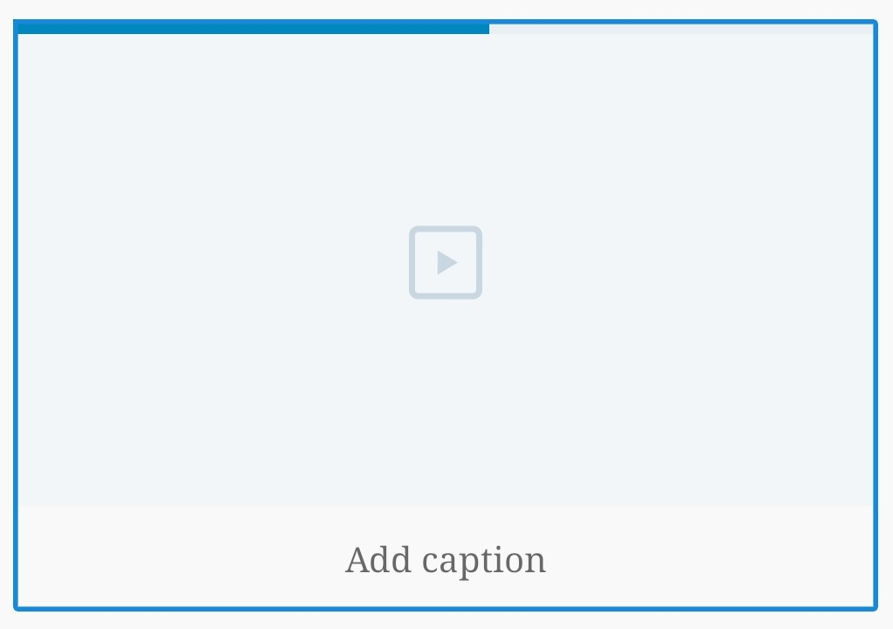
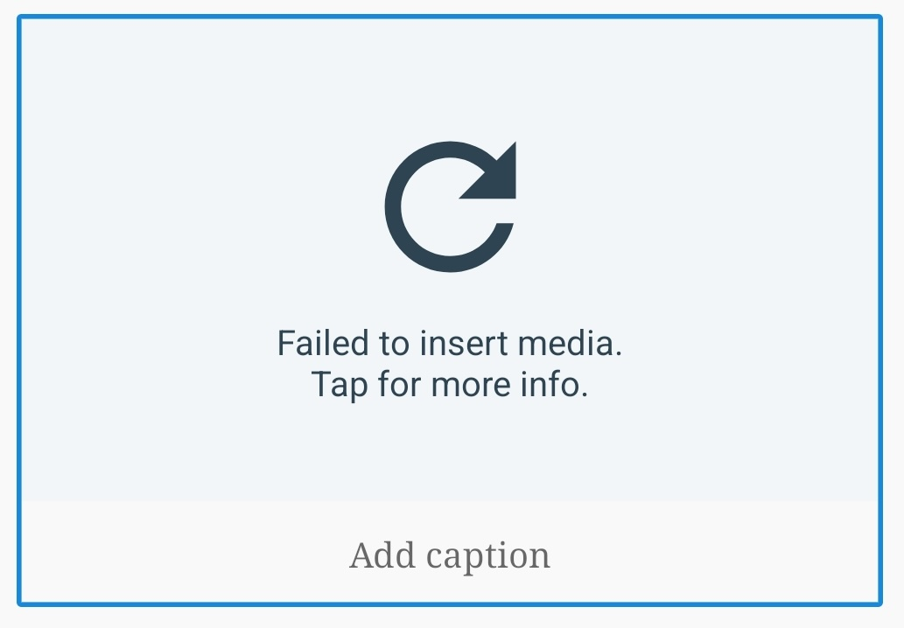
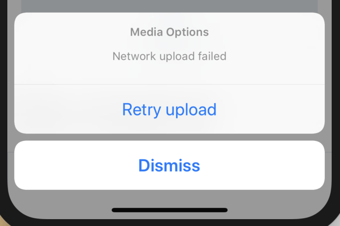

# Video Block - Test Cases

--------------------------------------------------------------------------------

#### **Precondition**

Free or Personal plans are limited to videos that are less than five minutes in length. Currently, there is no size limitation other than the available storage on the user's site.

--------------------------------------------------------------------------------

##### TC001

**Insert video from device (paused or failing)**

- Add a Video block
- Tap option ‘Choose from device’ and choose a Video ([precondition applies](#precondition))
- Disable the internet connection, for example:
  - By turning on Airplane mode
  - Throttling the connection with a proxy or third-party app
- You should see the "Working offline" notice
- Expect the block's placeholder to show the paused progress bar

In the event of an upload failure, which can be easily triggered when using a proxy or throttling the connection so it fails to return any data, you should see the following placeholder:
 

- Tap on the block's placeholder
- You should be asked to retry

- Tap retry
- The upload should continue

--------------------------------------------------------------------------------

##### TC002

**Insert video from device (cancel)**

Same with [image block TC002](https://github.com/wordpress-mobile/test-cases/blob/master/test-cases/gutenberg/image.md#tc002) 

--------------------------------------------------------------------------------

##### TC003

**Add Caption**

Same with [image block TC003](https://github.com/wordpress-mobile/test-cases/blob/master/test-cases/gutenberg/image.md#tc003)

--------------------------------------------------------------------------------

##### TC004

**Close/Re-open post with an ongoing video upload**

Steps are same with [image block TC004](https://github.com/wordpress-mobile/test-cases/blob/master/test-cases/gutenberg/image.md#tc004) except for the difference in UI:

--------------------------------------------------------------------------------

##### TC005

**Close post with an ongoing video upload**

Steps are same with [image block TC005](https://github.com/wordpress-mobile/test-cases/blob/master/test-cases/gutenberg/image.md#tc005) except for the difference in UI:

