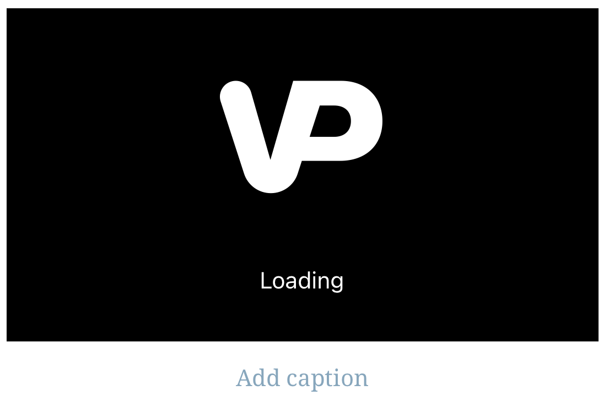
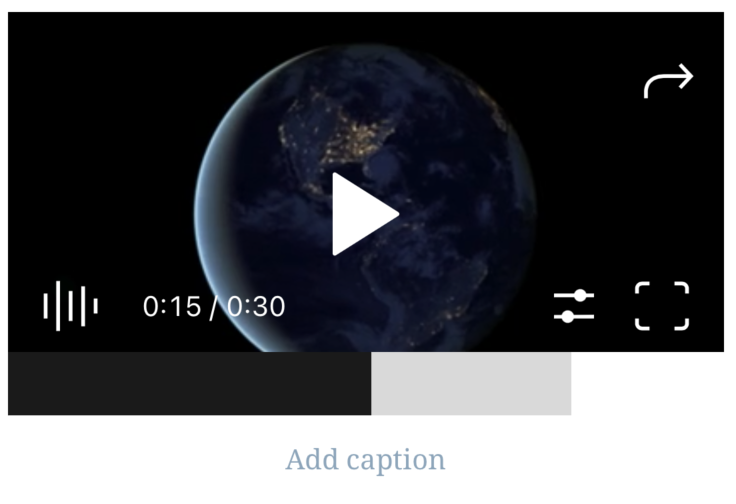
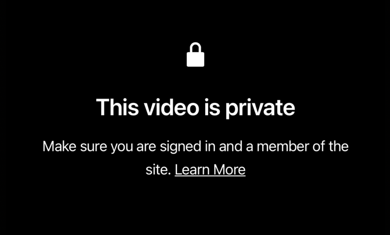
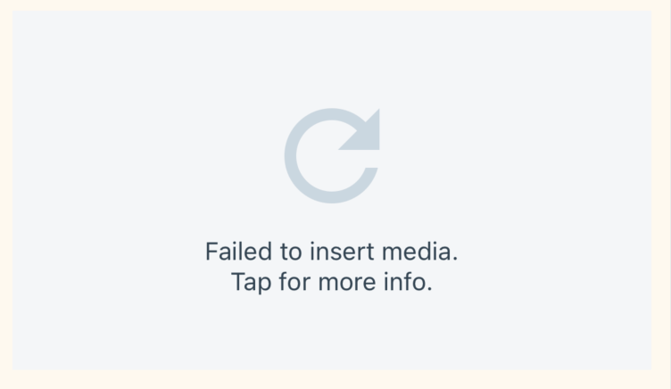
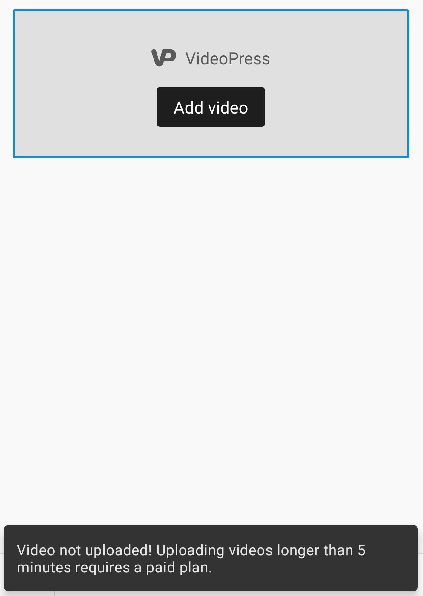

# VideoPress Block - Test Cases

--------------------------------------------------------------------------------

#### **Precondition**

Use Simple WordPress.com site with a Premium plan. Free or Personal plans only allow upload videos that are less than five minutes in length. Currently, there is no size limitation other than the available storage on the user's site.

--------------------------------------------------------------------------------

##### TC001

**Upload a video**

- Add a VideoPress block.
- Select “Choose from device” option.
- Select a video file.
- Wait until the video is uploaded.

- Wait until the VideoPlayer is loaded (embed content is loaded).

- Wait until the video is converted.

- Observe that the player displays the video.

##### TC003

**Player**

- Add a VideoPress block.
- Add a video (e.g. from the WordPress Media Library).
- Select the block.
- Tap on the video.
- (Optionally) Use the player UI:
  - Play/pause button.
  - Volume control.
  - Progress control.
  - Settings menu.
  - Picture-in-Picture (Only enabled in tablets).
  - Fullscreen (automatically enabled when playing).

**Note when testing iOS:** The video will be played in fullscreen by default. To use the player UI you might need to close the fullscreen modal.

**Note when testing Android:** The video is played within a WebView, so expect that when tapping on the video a new screen is open. The player UI can be used within that screen.

--------------------------------------------------------------------------------

##### TC004

**Close post with an ongoing video upload**

- Add a VideoPress block.
- Select "Choose from device" option.
- While video is uploading, leave the editor.
- Observe that you see the upload progress in post summary:

- Wait for the upload to complete while in the post list.
- Re-open the post with the VideoPres block.
- Observe that the video is displayed within the block.

--------------------------------------------------------------------------------

##### TC005

**Private video**

- Add a VideoPress block.
- Add a video (e.g. from the WordPress Media Library).
- Select the block.
- Tap the block’s settings toggle.
- Tap on the "Privacy and Rating" button.
- Tap on the "Privacy" button.
- Select "Private" option.
- Save the post.
- From the player UI, open the share settings by tapping on the top-right icon.
- Copy the video URL.
- Open the URL and paste it on a private/incognito tab in a browser.
- Observe the video can't be played.

--------------------------------------------------------------------------------

##### TC006

**Upload limit for Free users**

- Use Simple WordPress.com site with a Free or Personal plan.
- Add a VideoPress block.
- Select “Choose from device” option.
- Select a video file that is greater than five minutes in length.
- Observe that the upload fails.

iOS|Android
-|-
|

